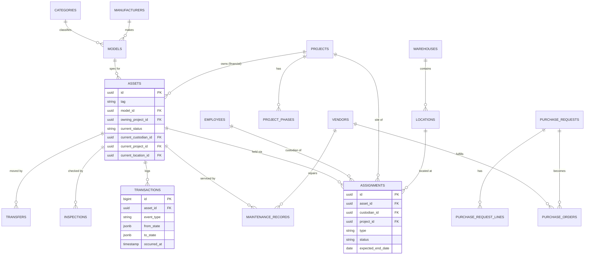
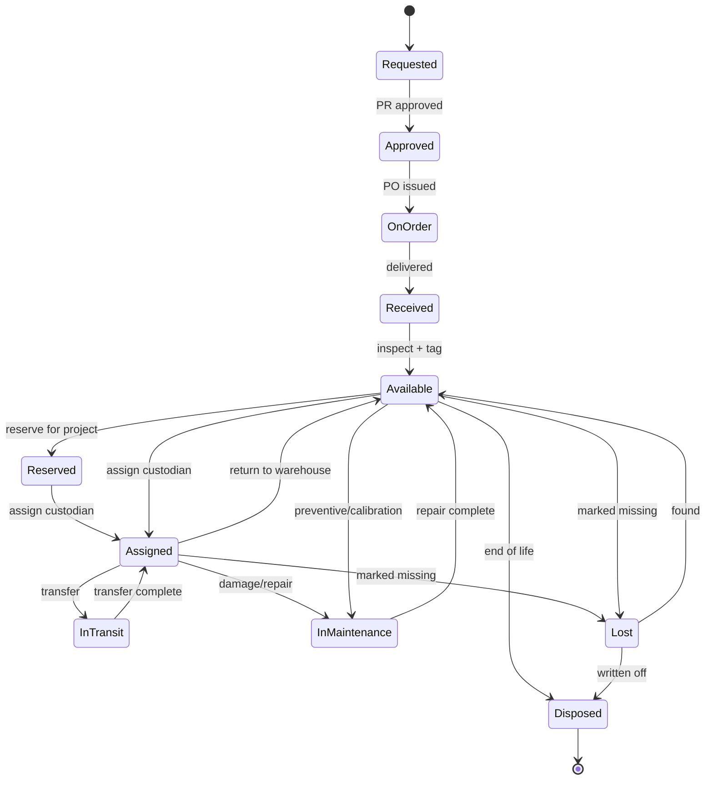
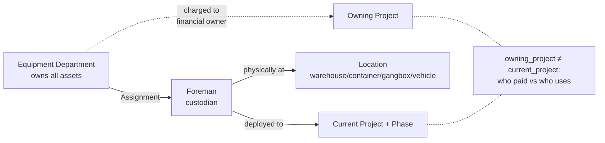
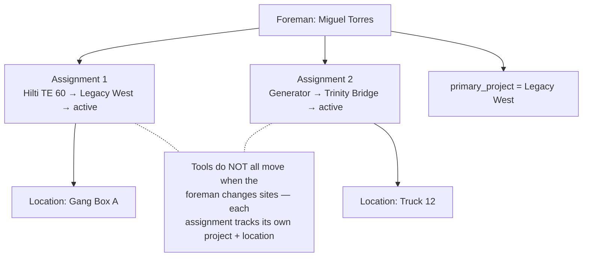
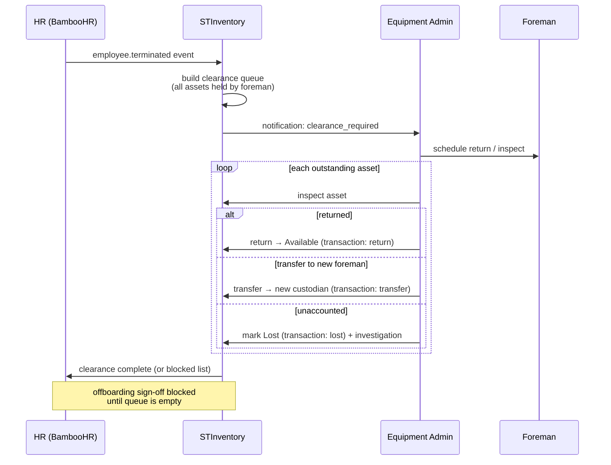
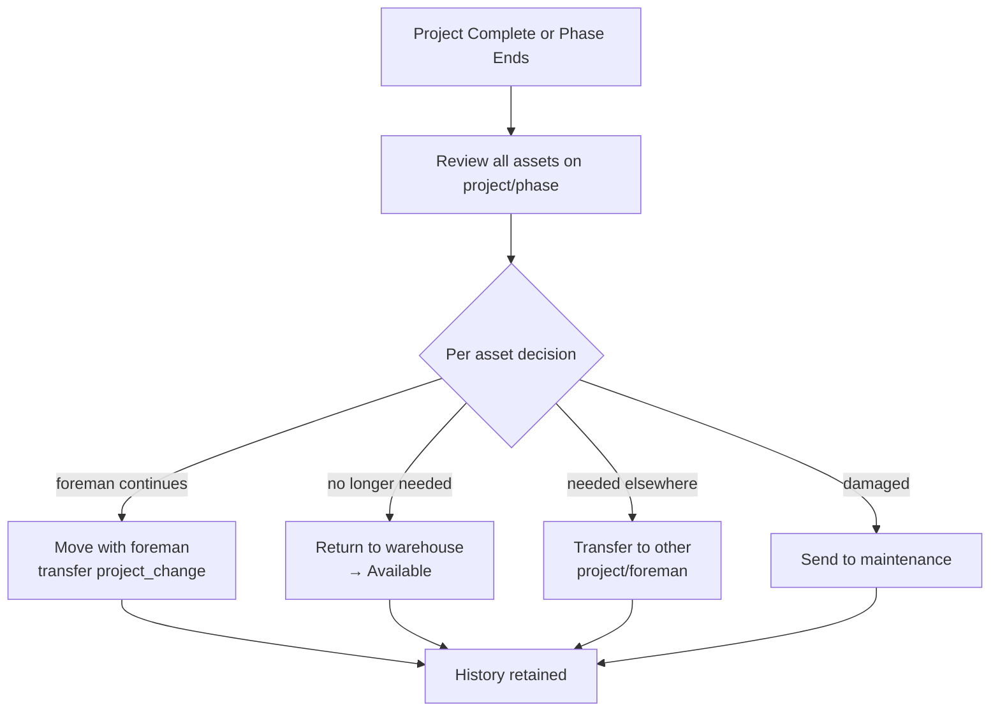
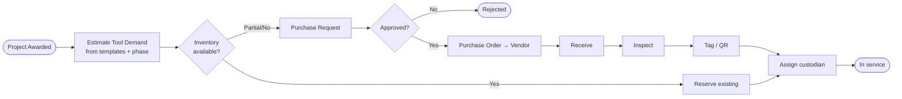
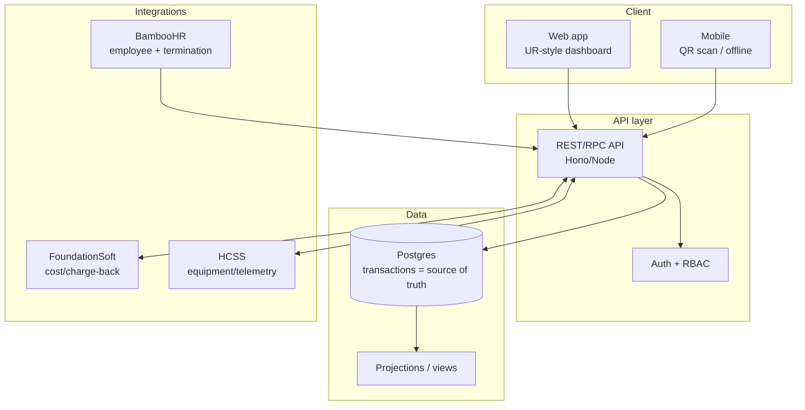
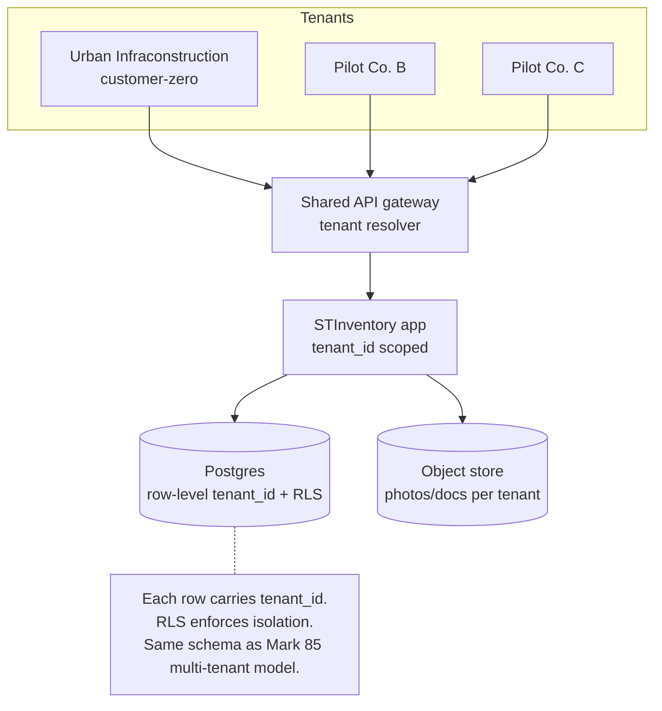
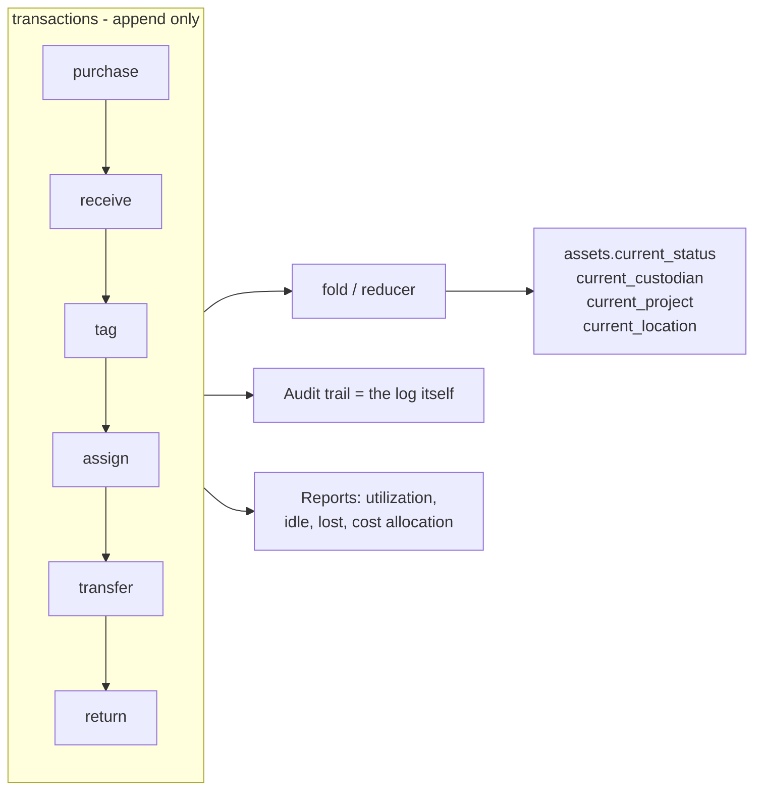

# STInventory — Diagrams

All diagrams are Mermaid (render in GitHub, VS Code with a Mermaid extension, or any
Mermaid live editor). Grouped by concern: domain, lifecycle, custody flows, procurement,
architecture, and SaaS multi-tenancy.

---

## 1. Entity relationship (core)

## 2. Asset lifecycle (state machine)

## 3. Custody model (who/what/where)

## 4. Scenario — foreman on multiple projects

## 5. Scenario — HR offboarding / foreman fired

## 6. Scenario — project complete / phase change

## 7. Procurement workflow (BPMN-style)

## 8. Deployment architecture (prototype → production)

## 9. SaaS multi-tenancy

## 10. How current-state is derived (event fold)

