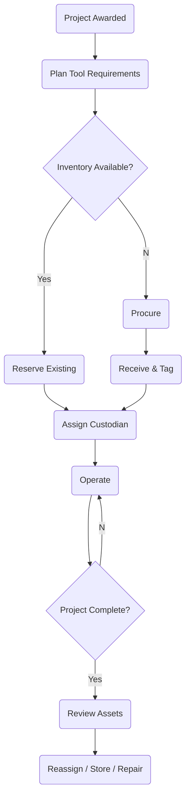

# STInventory — Internal Small Tools & Equipment Management

Master planning and functional specification for Urban Infraconstruction's internal
small-tools and equipment platform. Inspired by United Rentals' operating model, adapted
for an internal owner/custodian model rather than an external rental marketplace.

Status: planning only. No code yet. This is a standalone track; see §16 for how it
relates to Mark 85 and the legacy stack.

---

## 1. Vision

A centralized platform that manages the full life of internally owned construction tools
and small equipment: procurement, inventory, custody, movement, maintenance, planning,
and reporting. One source of truth for "what do we own, where is it, who has it, what
project is it charged to, and is it working."

The United Rentals analogy: UR runs a rental catalog, branch inventory, dispatch, and
billing against jobsites. STInventory reuses that shape — catalog, warehouse inventory,
dispatch/transfer, and charge-to-project — but the "customer" is Urban's own foremen and
projects, and there is no external revenue transaction. Internal charge-back (§14) is the
optional analog of UR's billing.

## 2. Principles

- The Equipment Department owns all assets. Ownership never transfers.
- Foremen are custodians, not owners. Custody is assigned and revoked.
- Projects consume and use tools; they do not own them. They may be charged for them.
- Every movement is an immutable transaction. Nothing is edited in place.
- Current state (where/who/status) is derived from transaction history, never stored as
  the sole truth.
- Financial ownership (cost/charge-back) is tracked separately from operational custody.

## 3. Core Entities

| Entity | Role |
|---|---|
| Asset | A single owned tool/equipment unit (serialized) or a bulk/consumable line |
| Asset Category | Classification (power tools, hand tools, safety, survey, etc.) |
| Manufacturer / Model | Catalog reference for an asset |
| Warehouse / Storage Location | Physical place an asset can live |
| Project | A job the tool is deployed to and charged against |
| Project Phase | WBS/phase within a project, drives demand + reassignment |
| Foreman / Employee | A person who can hold custody |
| Assignment | Active custody link: asset ↔ custodian ↔ project ↔ location |
| Transfer | Movement of an asset between custodians/locations/projects |
| Purchase Request | Demand not covered by inventory, pending approval |
| Purchase Order | Approved buy sent to a vendor |
| Vendor | Supplier / repair shop |
| Maintenance Record | Preventive, corrective, calibration, warranty, damage |
| Inspection | Scheduled or event-driven condition check |
| Transaction Log | Immutable append-only event history (system of record) |

## 4. Domain Model

```
Equipment Department
  └─ Asset
      ├─ Assignment ── Foreman
      │             ── Project (+ Phase)
      │             ── Location
      ├─ Transactions  (append-only)
      ├─ Maintenance
      └─ Procurement   (PR → PO → Receive)
```

## 5. Asset Lifecycle

```
Requested → Approved → Purchased → Received → Tagged → Available
   → Assigned → Returned → [Maintenance] → Available
   → Disposed / Lost
```

Every arrow above is a Transaction event (§13). Status is the projection of the latest
events, not a hand-edited field.

## 6. Custody Model

```
Equipment Dept → Assignment → Foreman → Current Project → Physical Location
```

An Assignment record holds:

- Asset
- Custodian (Foreman/Employee)
- Project (and optionally Phase)
- Location
- Start date
- Expected end date
- Assignment type: Permanent or Temporary
- Status
- Approval

Invariants:

- One active custodian per serialized asset at a time.
- A foreman may hold many assets across many projects.
- Temporary assignments carry a due date and drive overdue alerts.

## 7. Operational Scenarios

These are the cases that make this harder than a spreadsheet. The system must handle each
explicitly.

### 7.1 Project completes
- Move tools with the foreman to their next project, or
- Return all tools to a warehouse, or
- Partial: some returned, some transferred to another foreman/project.

### 7.2 Foreman on multiple projects
Track, per foreman: primary project, current site/location, and each active assignment's
project. Tools do not all move just because the foreman moved.

### 7.3 Temporary loan / assignment
Assignment with a due date. Overdue → escalating alerts to foreman + equipment dept.

### 7.4 HR offboarding (foreman fired / leaves)
HR event triggers an equipment clearance workflow:
outstanding assets listed → inspect → return or transfer each → anything unaccounted marked
Missing → investigation → history retained. Clearance blocks final offboarding sign-off.

### 7.5 Phase changes
When a project phase ends, surface tools now idle for that phase → recommend return to
warehouse or transfer to projects/phases that need them.

### 7.6 Lost tools
Mark Missing → investigation → optional replacement (new PR) → history retained forever.

### 7.7 Damage
Inspection → repair (in-house or vendor) → warranty check → back to Available.

## 8. Procurement Workflow

```
Project Awarded → Estimate Tool Demand → Check Inventory
  → Reserve Existing Inventory → Identify Shortages
  → Purchase Request → Approval → Purchase Order
  → Receive → Inspect → Tag → Assign
```

Charge-to-project happens at purchase/receive (financial ownership) and is independent of
which foreman later holds custody.

## 9. Maintenance

Supports: preventive (scheduled), corrective (repair), calibration, warranty claims,
damage reporting, and inspection schedules. Each generates Maintenance/Inspection records
and Transaction events; a tool in maintenance is not Available and cannot be assigned.

## 10. Storage Locations

Hierarchy of places an asset can be:

- Main warehouse
- Regional warehouse
- Site container
- Gang box
- Vehicle (crew truck / trailer)

## 11. Planning & Forecasting

Demand forecast inputs:

- Project schedule / dates
- Project phase / WBS
- Tool templates (standard tool kit per work package)
- Supplier lead times
- Existing reservations
- Current inventory on hand

Output: reserve-vs-procure recommendations ahead of each project/phase start.

## 12. Reports (the moat — build these first per module)

Asset Register, Assets by Project, Assets by Foreman, Utilization, Idle Assets, Lost
Assets, Maintenance History, Procurement Status, Transfers, Audit Trail, Cost Allocation.

## 13. Data & Events

Suggested tables:

Assets, Categories, Manufacturers, Assignments, AssignmentHistory, Projects,
ProjectPhases, Employees, Locations, Warehouses, PurchaseRequests, PurchaseOrders,
Vendors, Maintenance, Inspections, Transactions, Notifications.

Transaction (event) types:

Purchase, Receive, Assign, Transfer, Return, Repair, Inspection, Lost, Dispose,
CustodianChange, ProjectChange, LocationChange.

## 14. Permissions

Equipment Admin, Warehouse, Procurement, Project Manager, Foreman, HR, Finance, Read-only.

## 15. Dashboard KPIs

Available · Assigned · In Repair · Lost · Due Maintenance · Idle · Procurement Status ·
Upcoming Demand.

## 16. System Modules

1. Dashboard
2. Asset Register / Asset Management
3. Procurement
4. Warehouses & Locations
5. Projects (+ Phases)
6. Foremen & Employees
7. Assignments
8. Transfers / Logistics
9. Maintenance
10. HR Integration
11. Planning & Forecasting
12. Reporting
13. Administration

## 17. Process Flow



## 18. Roadmap

- Phase 1 — Asset Register (catalog, tagging, current-state)
- Phase 2 — Procurement (PR → PO → Receive)
- Phase 3 — Assignments & Transfers (custody + movement)
- Phase 4 — Mobile QR/barcode
- Phase 5 — Maintenance & Inspections
- Phase 6 — Planning & Forecasting
- Phase 7 — ERP / Accounting integration (FoundationSoft charge-back)
- Phase 8 — RFID / BLE tracking

## 19. Relationship to Mark 85 and the legacy stack

STInventory is planned as a **separate track** for now — its own folder, its own scope,
its own roadmap. It is not part of the timesheet/legacy system and is not (yet) a Mark 85
module.

Intended convergence points (not commitments):

- Shared identities: Projects, Phases, Employees/Foremen already exist in Urban's world.
  STInventory should eventually read these from the same source Mark 85 uses rather than
  re-entering them.
- FoundationSoft is the accounting/cost-code system of record; charge-to-project and
  internal charge-back should route through it, matching Mark 85's integration boundary.
- HR offboarding (§7.4) needs an HR trigger — BambooHR today, potentially a Mark 85 HR
  module later.
- Design/UX must obey Urban's hard field-simplicity constraint: reports first, dumb-simple
  UI for foremen, mobile scanning over typing.

When Mark 85 matures, STInventory is a candidate to fold in as the Equipment/Small-Tools
module, or to stay a satellite app that shares Mark 85's data layer. Decide later.

## 20. Open Design Topics

- Financial ownership vs operational ownership — exact rule set.
- Internal rental / charge-back policy — flat, daily, or none.
- Tool templates by work package — who defines them.
- Multi-company support (Urban entities / Bodhi).
- Offline mobile workflow (yards/sites with no signal).
- Approval matrix for PR/PO and high-value custody.
- Notifications & SLA (overdue, missing, maintenance-due).
- Serialized assets vs bulk/consumable small tools — one model or two.
