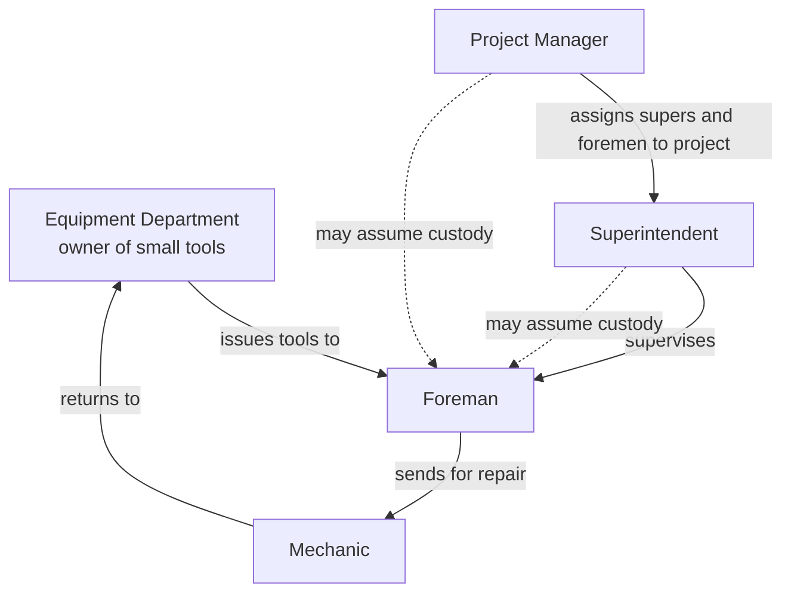
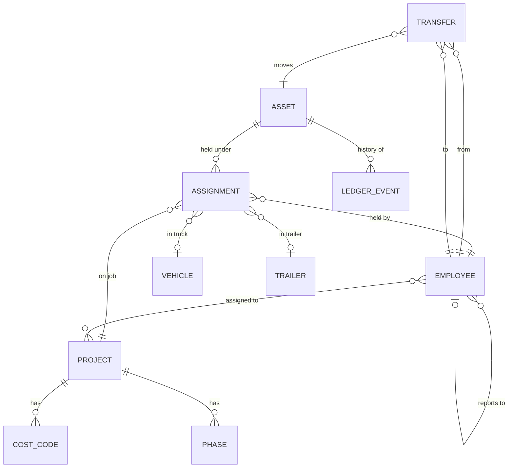
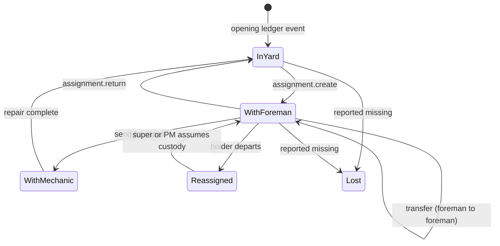
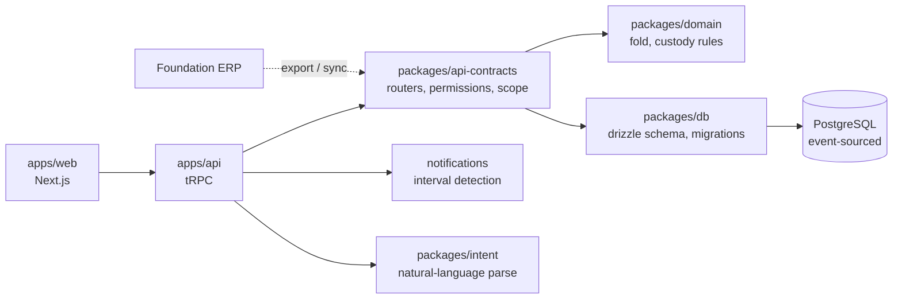
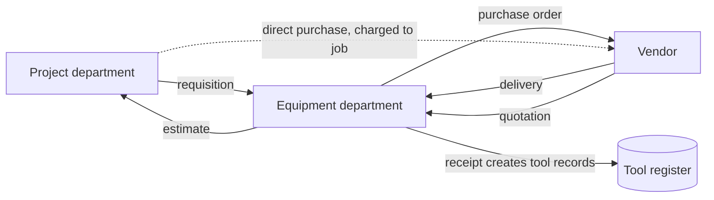

# STInventory — System Plan

**Owner:** Bodhi Labs Pvt. Ltd. for Urban Infraconstruction
**Status:** Release 1 in delivery, target 23 August 2026
**Purpose of this document:** the single reference for what the system is, what exists, what is being built, and what comes next. Written to be read by both people and language models. When an AI assistant is asked to work on this codebase, this file is the intended starting context.

> **Reading rule for AI assistants.** Statements under *Current state* are grounded in a file-level assessment dated 2026-08-09. Statements under *Roadmap* are intent, not fact. Pseudo-code is illustrative of intended shape, not literal source. Verify against the repository before acting on anything here.

---

## 1. What the system is for

Urban Infraconstruction is a US construction contractor. Small tools — hand tools and power tools, explicitly **not heavy equipment** — are bought either against a project budget or by the Equipment department, then issued to foremen. A foreman loads them into a company trailer, tows the trailer with a company or personal truck, and drives to a jobsite. Tools move between foremen, go to mechanics for repair, and return to the yard.

The spreadsheet that tracks this cannot answer the questions that matter: *where is this tool, who has it, which job is it on, which trailer is it in, and who is accountable if it disappears.*

The system is a **web-based system of record for tool custody**, with an append-only history so that every answer is provable rather than asserted.

### Non-goals for Release 1

- ~~No mobile application. All actions are performed at a desk on the web app.~~
  **False since the Expo app landed** (`apps/mobile` — My Tools, hand-off, alerts, desk,
  chat with @-mentions; root `CLAUDE.md` has said "Expo mobile" for some time). The non-goal
  was never formally retired, so this line sat contradicting the repository it describes.
  Corrected 2026-08-22.
- No QR or barcode scanning, no photograph or signature capture at handover.
- No offline operation.
- No heavy equipment, consumables, or preventive maintenance.
- No procurement.

---

## 2. Who uses it

Two organisational groups plus the engineering team.

| Group | Roles | Relationship to tools |
|---|---|---|
| **Equipment department** | Department head, Equipment Administrator | **Owns** the small tools programme. Super-users. Buys tools, issues them, runs the desk queue, resolves disputes. |
| **Project / operations** | Project Manager, Superintendent, Foreman, Engineer | Consumes tools. PM owns the project; superintendents run crews; foremen hold tools. |
| **Engineering** | System Administrator (Bodhi Labs) | Platform administration, schema, releases. Distinct from Office Administrator, who is an Urban business-side admin. |
| **Support** | Mechanic | Holds tools while repairing them. |
| **Office** | Office Administrator | Business administration; not a system administrator. |

> **Terminology trap.** "Admin" is ambiguous in Urban's usage and must never be a single role in code. It resolves to at least three distinct things: *System Administrator* (Bodhi Labs engineering), *Equipment Administrator* (owns tools), *Office Administrator* (business admin). Permissions must be checked, never role names — see §6.3.

### Organisational hierarchy



The dotted lines are the **departure path**: when a foreman leaves or is dismissed, their tools, trailers and *company* trucks are reassigned in one action to their superintendent, or to the Project Manager where necessary. Personal vehicles are never reassigned — they are not Urban property and leave with the person.

---

## 3. Domain model



### Core invariants

These are the rules the system exists to guarantee. Each must be enforced at the **database** level, not only in application code.

1. **One active assignment per asset.** A tool is held by exactly one party at any instant. Enforced by a partial unique index, not by application logic.
2. **The ledger is append-only.** No `UPDATE`, no `DELETE`, ever. Enforced by grant restriction or trigger, not by comment.
3. **Custody writes are atomic.** The projection update, the custody move and the ledger insert succeed together or not at all — one transaction.
4. **The projection is derivable.** Folding the ledger from the beginning must reproduce the current register exactly. A scheduled check proves it.
5. **Every assignment carries full context.** Job, truck and trailer — all three, independently nullable but independently recordable.

> Invariant 5 currently fails: assignment holds a single `locationId`, which cannot represent a truck *and* a trailer simultaneously. This is Release 1 Phase 2.

### Custody state machine



**Desk-origin model, not verification model.** *(Corrected 2026-08-18, STI-111. The paragraph this replaces described the pre-2026-08-09 design and was still being read as live behaviour.)* Urban operates a desk, and the desk is the only writer of movements: foremen hold neither `assignment.create` nor `transfer.create` — both were removed on 2026-08-09, with the rationale in `packages/domain/src/rules.ts`. Every hand-off is recorded at the desk as `pending_approval` and approved or declined there; nothing moves first to be verified later, because nobody but the desk can record a move. The receiving foreman is still never asked to accept — do not implement recipient accept/reject. The `pending_verification` transfer state is **historical only**: no writer can produce it, and its enum entry survives solely so that old rows still render.

---

## 4. Architecture



**Event-sourced core.** The ledger is the truth; `current_*` tables are a projection for query performance. Any disagreement between them is a bug, and invariant 4 is how it gets caught.

**Monorepo, pnpm.** Packages: `db`, `domain`, `api-contracts`, `auth`, `types`, `env`, `intent`. Apps: `web`, `api`.

---

## 5. Current state

Assessed 2026-08-09 at **63.6% complete** by size-point arithmetic (121 of 190 points),
excluding the conversational layer — see §8.1.

> **That figure is stale and has deliberately not been recomputed.** Phases 3 and 5 shipped
> on 2026-08-22 (27 of the remaining units), leaving Phase 4 as the only phase outstanding —
> and Phase 4 is blocked on Urban rather than on engineering. A recomputed percentage would
> be a confidently wrong number of exactly the kind CLAUDE.md tells us not to state, because
> the arithmetic never counted the follow-up tickets, the conversational layer or the
> reachability gap. **Read the phase table in `docs/tickets/STATUS.md` instead** — it says
> which phases are done and what is left, which is the question the percentage was standing
> in for.

| Area | Status | Note |
|---|---|---|
| Foundation | `FUNCTIONAL` | Event-sourced schema, CI with build/migrate/smoke/deploy/rollback. ~~12 migrations~~ — a count that went stale immediately; `packages/db/drizzle/` is the authoritative list, as CLAUDE.md's own conventions say it should be. |
| Access control | `FUNCTIONAL` | ~~5 of 7+ roles can log in. **No user administration exists at all.**~~ It was 3 of 10, not 5 of 7. Since STI-303/304/302/307/308 (2026-08-22): user administration at `/admin/users`, **one login account per role**, the four-tier visibility ladder enforced in the query rather than as a post-filter, no role-name branching left in server code, and an RBAC matrix test generated from `packages/db/src/role-perms.ts`. |
| Master data | `PARTIAL` | Tools, projects, employees, locations, trucks and trailers have full CRUD; `category` has create/delete but no update. ~~Vendors read-only.~~ **There is no vendor table, router or screen at all** — not read-only, absent. Verified 2026-08-22. |
| Custody engine | `PARTIAL` | Best-designed area. ~~**Approve/verify/decline procedures have no caller in any screen.**~~ Reachable since STI-105 (2026-08-16): approve/decline are driven from the desk queue at `/custody?tab=queue`. The `verify` outcome no longer exists. |
| Spreadsheet import | `FUNCTIONAL` | Genuinely good: typed validation, dedup, preview, transactional commit. No tests. |
| KPI dashboard | `FUNCTIONAL` | Reports, filters, export — see `routers/report.ts` for the list. ~~Ignores project scoping.~~ Every tile, chart, count and report is narrowed by the visibility ladder since STI-302; the aggregates were the widest leak in the product, because a total over rows you may not read is a read of those rows. |
| Notifications | `PARTIAL` | Delivery is a `console.log` that then marks rows delivered. |
| Production readiness | `PARTIAL` | ~~No error boundaries~~ — `apps/web/app/(app)/error.tsx` and `global-error.tsx` exist. ~~No integration tests~~ — the database-backed suites in `packages/api-contracts` run router+domain+db together against real Postgres, including concurrency races. ~~What is genuinely missing is a browser E2E harness~~ — **built 2026-08-22** (STI-001): 27 browser specs across five roles in `e2e/`, plus the first tests in `apps/api`. **It does not gate a merge yet** — the CI job is deliberately non-blocking until STI-122. Still missing: any test under `apps/web` or `apps/mobile` themselves. Lint non-blocking: still true. |

### The five things that matter most

1. ~~**The desk queue is unreachable.**~~ **RESOLVED — STI-105.** Correct backend procedures, no UI calling them, and the transfer form directed users to an Inbox that cannot handle transfers. An Approval queue tab now drives all six procedures.
2. ~~**Custody writes are not atomic.**~~ **RESOLVED — STI-102.** Every custody procedure now wraps close + open + projection + ledger in one transaction, anchored on a `SELECT … FOR UPDATE` of the asset row. Passing a raw `db` handle is a compile error.
3. ~~**One-active-assignment has no DB constraint,**~~ **RESOLVED — STI-103.** Partial unique index `assignment_one_active_uq` on `assignment (asset_id) WHERE status = 'active'` (migration `0015`).
   **The second half of this finding was wrong.** "Duplicates already exist in live data" did not hold: the local database was verified duplicate-free on 2026-08-16 and again on 2026-08-18 (754 assets, 754 active assignments, zero duplicates), so the per-tool backfill judgement §6.1 warns about was not needed. **Production has not been checked.** Run the same query there before applying `0015`; if it returns rows, stop and take it to the Equipment department rather than writing a script that picks a survivor.
4. ~~**The ledger is append-only by comment only.**~~ **RESOLVED — STI-104,** though not as planned. The proposed `REVOKE UPDATE, DELETE` would have enforced nothing: there is no `app_role`, the app connects as the table owner, and Postgres treats an owner as holding all grant options. Shipped as a trigger raising `0A000` on UPDATE, DELETE and TRUNCATE, which fires for every role including superuser.
5. ~~**Two migrations are uncommitted.**~~ **RESOLVED — STI-107.** Migrations are committed and CI now fails on schema drift across seven drift shapes, including renames, which exit 0 silently and were the hole in the first attempt.

---

## 6. Release 1 — by 23 August 2026

48 units, 5 phases, USD 2,500. One unit ≈ half a developer-day.

### 6.1 Phase 1 — Custody trail (13 units)

Make the history trustworthy before anything is built on top of it.

```
# Atomic custody write — the shape every custody mutation must take
def apply_custody_change(actor, asset, action, context):
    require_permission(actor, action)

    with db.transaction() as tx:                    # invariant 3
        current = tx.lock_for_update(active_assignment(asset))
        validate_transition(current.state, action)  # domain rules, pure

        tx.close_assignment(current)
        new = tx.open_assignment(
            asset      = asset,
            holder     = context.holder,
            project    = context.project,
            truck      = context.truck,             # invariant 5
            trailer    = context.trailer,
        )
        tx.append_ledger(                           # invariant 2, append-only
            asset     = asset,
            action    = action,
            actor     = actor,
            snapshot  = new.to_snapshot(),
            occurred  = now(),
        )
        tx.update_projection(asset, new)
    notify_desk_if_pending(new)
    return new
```

```sql
-- Invariant 1, at the database
CREATE UNIQUE INDEX assignment_one_active_uq
  ON assignment (asset_id)
  WHERE status = 'active';

-- Invariant 2, at the database.
-- NOTE 2026-08-16: the REVOKE originally proposed here does not work. There is no
-- `app_role`; the app connects as the table owner, and Postgres treats an owner as
-- holding all grant options -- so revoking from the owner stops nothing. Shipped
-- instead as a trigger (migration 0014), which fires for every role including
-- superuser. See STI-104.
CREATE TRIGGER transaction_no_update_delete
  BEFORE UPDATE OR DELETE ON "transaction"
  FOR EACH ROW EXECUTE FUNCTION transaction_append_only();  -- raises SQLSTATE 0A000
```

```
# Invariant 4 — scheduled reconciliation
def verify_projection():
    divergent = []
    for asset in all_assets():
        folded = fold(ledger_events_for(asset))     # pure, packages/domain
        if folded != projection_for(asset):
            divergent.append((asset, folded, projection_for(asset)))
    report(divergent)                                # must be empty
```

Tasks: desk queue screen (approve / decline) · atomic writes · unique index · ledger immutability · reconciliation check · desk alert on pending · commit migrations + drift detection in CI.

*(Corrected 2026-08-18: the `verify` outcome and the borrow/held distinction were removed from the backend on 2026-08-09 and cannot be built. The duplicate backfill proved unnecessary locally — see §5 item 3.)*

**Risk.** The duplicate backfill must decide which of two active assignments survives. That is a per-tool judgement made with the Equipment department, not a script.

### 6.2 Phase 2 — Assignment detail (7 units)

Truck and trailer as first-class fields. Company and personal trucks distinguished, because the distinction drives the departure path in Phase 3.

```
Assignment {
  asset_id, holder_id, project_id,
  truck_id?    -> vehicle(ownership: 'company' | 'personal')
  trailer_id?  -> trailer(always company)
  status, opened_at, closed_at
}
```

Migrating from single `locationId` touches every reader and every ledger snapshot shape. Snapshots are historical and must not be rewritten — the fold must handle both old and new shapes.

Plus error boundaries and typed `TRPCError` across routers.

### 6.3 Phase 3 — Roles, accounts and organisation structure (18 units)

**Delivered 2026-08-22.** The pseudocode that stood here is replaced below by what the
system actually does — STI-301 acceptance criterion 3.

> **On what Urban agreed.** Urban never returned `docs/workings/PERMISSION_MATRIX.md`.
> That document states its own policy — *"Silence is an answer. Every default above is what
> gets built if this document is not returned"* — and the defaults are what was built. Six
> of them are recorded in §8.2 as still reversible, cheaply now and expensively later. This
> is a decision taken under a stated rule, not agreement obtained.

**The ladder.** Four permissions, resolved widest-first, first match wins, so a role holding
two gets the wider one. It lives in `packages/api-contracts/src/scope.ts` and the order is
`VIEW_SCOPES` in `packages/types` — written once, read by both the resolver and the test.

| Tier | Held by | Resolves to |
|---|---|---|
| `assets.view.all` | System/Equipment/Office Admin, Warehouse, Procurement, HR, Finance, Read-only | Everything in the tenant |
| `assets.view.project` | Project Manager, Engineer | Tools on the projects they are on the team of, plus any job groups handed to the account |
| `assets.view.crew` | Superintendent | Tools held by the foremen reporting to them — **and themselves** |
| `assets.view.own` | Foreman, Mechanic | Tools in their own custody |
| *(none)* | — | **Nothing.** An empty result, never an unscoped one |

Two properties that are not negotiable, and both have a test:

- **The narrowing is applied to the query, never as a post-filter** (§7, §9). A count over
  rows you may not read is a read of those rows: a tile saying "312 assigned" above a list
  of four has disclosed 308 tools.
- **No tier means no rows.** `assetScopeWhere` returns `undefined` for the desk, meaning "do
  not narrow" — and Drizzle's `and()` drops an `undefined`. So the difference between "sees
  nothing" and "sees everything" is one dropped branch, which is why that case is a named
  constant (`MATCHES_NOTHING`) with a test of its own.

An account with **no employee record** — Office Administrator, the back-office logins —
cannot reach a person-shaped tier at all, because `own`, `crew` and `project` are all
statements about a person. It resolves to nothing rather than everything.

**Permissions are checked; role names are not branched on.** True in server code as of
STI-307: the only surviving `role === "…"` comparisons read `employee.role` — domain data,
a fact about a person — and each is annotated as such where it stands.

```
# Departure — reassign everything a leaver holds, in one auditable action
def reassign_on_departure(actor, leaver, successor=None):
    require_permission(actor, 'custody.reassign')

    successor = successor or superintendent_of(leaver) or project_manager_of(leaver)
    assert successor, "no successor in the reporting chain; choose explicitly"

    with db.transaction() as tx:
        for item in held_by(leaver):                  # tools, trailers, trucks
            if item.kind == 'vehicle' and item.ownership == 'personal':
                continue                              # never Urban property
            apply_custody_change(actor, item, 'reassign_on_departure',
                                 context(holder=successor, reason='departure'))
        tx.deactivate_user(leaver)
```

**Tasks, and where each one landed:**

| Task | Ticket | Status |
|---|---|---|
| Permission matrix defined with Urban | STI-301 | **Taken at its documented defaults** — see the note above |
| Missing login roles | STI-304 | Done. `office_admin`, `engineer`, `mechanic` added; one login account per role |
| User administration (create, assign role, deactivate, reset password) | STI-303 | Done 2026-08-19 — `/admin/users` |
| Organisation structure assignment | STI-303/306 | Done — project teams, reporting chain seeded |
| Departure reassignment | STI-306 | Done 2026-08-19 |
| Tenant-scoped login | STI-305 | Done |
| Permission-based scoping replacing role-name checks | STI-302 / STI-307 | Done — the ladder above; no role-name branches left in server code |
| RBAC matrix test across all roles | STI-308 | Done — `packages/api-contracts/src/rbac-matrix.test.ts` |

**"Admin" resolves three ways, as §2 requires.** *System Administrator* is the `owner` role
in code — deliberately NOT a fourth `system_admin` role, which would be a second
all-permissions role and two names for one authority. *Equipment Administrator* is
`equipment_admin`. *Office Administrator* is the new `office_admin`, and it holds **no**
`config.manage`: that grant also carries the LLM configuration and the high-value approval
threshold, and "may add a user" is not the same authority as "may change what needs a second
signature". Consequence, stated plainly: **an Office Administrator cannot create users or
reset passwords.** That is §8.2 open decision 4 at its default.

~~**Open question that blocks this phase:** nobody has yet defined what an Engineer may
do.~~ **Answered at the default:** an Engineer holds a Project Manager's permission set
exactly — `engineer: PM_PERMS` in `role-perms.ts`, shared rather than copied so the two
cannot drift. They run work on a project rather than owning it commercially, but their
relationship to small tools is identical. The role exists separately so reporting can tell
them apart and so the two can diverge later without a migration.

### 6.4 Phase 4 — Foundation entity load (6 units)

One-time load of **users, jobs, cost codes and phases** from a Foundation export. The mechanism must be built so that later loads, hand-entered records and future automated sync all use the same identity rules.

```
# Idempotent upsert keyed on the source system's own identifier.
# Re-running a load updates; it never duplicates.
def load_from_foundation(export, actor):
    report = {'created': [], 'updated': [], 'unmatched': []}

    for row in export.rows:
        key = ExternalRef(system='foundation', type=row.type, id=row.native_id)

        existing = find_by_external_ref(key)
        if existing:
            changed = diff(existing, row)
            if changed:
                update(existing, row, source='foundation')
                append_ledger(existing, 'synced', actor, changed)
                report['updated'].append(key)
            continue

        candidate = fuzzy_match(row)        # name + job number, for pre-existing rows
        if candidate and not candidate.external_ref:
            attach_external_ref(candidate, key)      # adopt, do not duplicate
            report['updated'].append(key)
        elif candidate:
            report['unmatched'].append((row, 'conflicts with different external ref'))
        else:
            created = create(row, external_ref=key, source='foundation')
            append_ledger(created, 'imported', actor, row)
            report['created'].append(key)

    return report                            # unmatched rows are surfaced, never dropped
```

**Redundancy strategy — the three entry paths must converge.**

| Path | Identity rule |
|---|---|
| Synced from Foundation | `external_ref(foundation, type, native_id)` — authoritative |
| Imported from spreadsheet | matched on natural key, then given an `external_ref` if one is found later |
| Added by hand | no `external_ref` until a sync adopts it; adoption is by natural-key match |

Every entity therefore carries: `external_ref` (nullable, unique per system+type), `source` (`foundation` \| `import` \| `manual`), and `last_synced_at`. Fields owned by Foundation are read-only in the UI once an `external_ref` exists, so a local edit cannot silently diverge and then be overwritten.

### 6.5 Phase 5 — Desk views by role (4 units)

**Delivered 2026-08-22.** The Desk is at `/desk`, composed from
`apps/web/components/desk/panel-registry.tsx` by permission alone — no role name
appears in the composition, and adding a panel is one entry in that array.

It is a ROUTE rather than a tab on the dashboard, which only became obvious in a
browser: `/home` redirects field roles to `/my-tools`, so a Desk living there
would have been unreachable for the foreman, mechanic and superintendent that
`tools.mine` and `crew.tools` exist for.

**Four of the five panels below are built. `tools.overdue` is not, and that is a
finding rather than an omission:** nothing in this system can go overdue. The
borrow model was removed on 2026-08-09, `assignment.expected_end_date` was
DROPPED in migration `0012`, and `isOverdueLoan` was deleted from
`packages/domain`. Building the panel would mean inventing a due date — the
exact failure CLAUDE.md records, where a stale document produced a ticket
specifying a control for a state the backend had already deleted. The stale
claim had spread to four other documents and has been corrected in each.

| Panel | Permission | Visible to | Source |
|---|---|---|---|
| `tools.mine` | `assets.view.own` or wider | anyone with an employee record | `asset.list` scoped to self |
| `crew.tools` | `assets.view.crew` **exactly** | superintendents — only they have a crew | `employee.myForemen` + `asset.list` |
| `tools.by_jobsite` | `assets.view.project` or wider | PM, Engineer, and the desk | `asset.list`, grouped, with truck and trailer |
| `desk.queue` | `assignment.approve` | whoever signs off custody | `dashboard.pendingApprovals` |
| ~~`tools.overdue`~~ | — | — | **the concept does not exist** |

"At least this wide" versus "exactly this" is the one place §6.5's
one-permission-per-panel proved too coarse: the ladder is ORDERED, so the yard
desk holding `assets.view.all` must satisfy a `project` requirement, while
`crew.tools` must NOT be shown to someone with no crew. Both questions are
needed; `tierAtLeast` in `packages/types` answers the first and is unit-tested
over all sixteen tier pairs.

The Desk is the intended long-term surface for the entire system. Release 1 establishes it for small tools only.

```
# The Desk is composed, not hard-coded per role.
def build_desk(actor):
    panels = []
    for panel in PANEL_REGISTRY:                  # declarative, extensible
        if has_permission(actor, panel.permission):
            panels.append(panel.render(scope=visible_scope(actor)))
    return Desk(panels=panels, scope=visible_scope(actor))

PANEL_REGISTRY = [
    Panel('tools.by_jobsite',  'assets.view.project', ToolsByJobsite),
    Panel('tools.mine',        'assets.view.own',     MyTools),
    Panel('crew.tools',        'assets.view.crew',    CrewTools),
    Panel('desk.queue',        'assignment.approve',  PendingQueue),
    Panel('tools.overdue',     'assets.view.all',     OverdueTools),
]
```

Registry-driven so Release 2 adds panels without touching role logic. Tools-by-jobsite shows holder, truck and trailer against each tool.

---

## 7. Roadmap

### Release 2 — next engagement

**The Desk question-and-answer interface.** A user describes the view they want in their own words; the Desk assembles it from the panel registry. `packages/intent` already parses natural language, and messaging, tasks and inbox already exist — this is an extension of built work, not a new capability.

```
# Generative view assembly — Vercel AI SDK generative UI pattern
async def answer_on_desk(actor, question):
    intent = await parse_intent(question, schema=DESK_INTENT_SCHEMA)
    # intent := { entity, filters, group_by, time_range }

    allowed = visible_scope(actor)                # authorisation BEFORE data access
    if not intent_within_scope(intent, allowed):
        return refuse(actor, intent)              # never leak out-of-scope existence

    data  = execute_scoped_query(intent, allowed)
    panel = select_panel(intent)                  # from PANEL_REGISTRY
    return stream_ui(panel, data)
```

> **Security rule, non-negotiable.** The model chooses *presentation*; it never chooses *scope*. Authorisation is applied to the query before execution, never as a post-filter on results, and never delegated to the model.

**Ongoing Foundation synchronisation.** Scheduled, idempotent, reusing the Phase 4 identity rules. Cannot be sized until the Foundation interface is known — a nightly CSV drop is days; a live API with conflict resolution is weeks.

Also: email and SMS delivery with overdue escalation · vendor management · import history and undo (as compensating events, never deletes) · additional reports and server-side export · integration and end-to-end tests · Redis rate limiting · backup and restore runbook.

### Later releases

**Procurement.** Not near-term, but the intended shape:



Requisition → approval → estimate → quotation → purchase order → receipt → tool records created automatically with the purchase source (project-funded or Equipment-funded) recorded. Order tracking throughout.

**Also later:** foreman mobile application · heavy equipment · consumables and depletion · preventive maintenance and calibration · job cost allocation and chargeback rates.

**Research capability.** A GPU workstation (NVIDIA DGX Spark / ASUS Ascent class) provided by Urban and held by Bodhi Labs, for training and AI research on system functions. Urban's property; Bodhi Labs may use spare capacity for its own R&D but may not commercialise it.

---

## 8. Open questions

### 8.1 The conversational layer — resolved, record it

`packages/intent`, `routers/messaging.ts`, `routers/task.ts`, `routers/inbox.ts` and the mobile chat screens are working, tested, substantial code that the original eight-area brief never mentioned. It is **the Desk direction, partially built**. It is excluded from the 63.6% arithmetic because it carries no gap tasks and because scope should be agreed before it is invoiced. Commercial position needs settling explicitly: built for Urban, or Bodhi Labs platform.

### 8.2 Still open

| Question | What settles it |
|---|---|
| ~~What may an Engineer do?~~ | **Built at the default** — a Project Manager's permission set exactly. Reversible with a one-line change to `role-perms.ts` until it ships. |

**Six decisions taken at their documented default, because `PERMISSION_MATRIX.md` was
never returned.**

> **This is no longer a blocker, and the reason is a product change rather than an
> answer.** `/admin/roles` lets an administrator tick permissions on and off per role, so
> none of the six is a migration any more — Urban reads what the roles actually hold and
> changes what they disagree with, with no developer and no deploy. The defaults below are
> now a *starting position* rather than a decision made on their behalf.
>
> **What that cost:** `packages/db/src/role-perms.ts` used to BE the matrix, and STI-308
> asserted the database matched it exactly in both directions. It cannot mean that once an
> administrator can edit grants — the moment somebody unticks a box the database is
> *supposed* to differ. `role-perms.ts` is now the FACTORY DEFAULT, the test asserts a
> freshly seeded tenant matches it, and what guards the live database instead is the audit
> trail: `role.setPermissions` logs the delta, so "who took approval away from the
> superintendents, and when" stays answerable.
>
> Still worth walking Urban through the table below — a default nobody looked at is not the
> same as a decision, and the screen only helps if somebody opens it.

| # | Question | Built as | To change it |
|---|---|---|---|
| 1 | What may an Engineer do? | A Project Manager's set, exactly | One line in `role-perms.ts` |
| 2 | What does a Mechanic see? | Their own custody only. *The matrix flags this as the line most likely to be wrong* — the alternative is a department-wide view | Swap `assets.view.own` for `assets.view.all` |
| 3 | Does "Admin" split three ways? | Yes — `owner` (System), `equipment_admin`, `office_admin` | — |
| 4 | May an Office Administrator create users and reset passwords? | **No.** `config.manage` also carries LLM config and the approval threshold; the three were not split on a default | Split `config.manage`, or grant it |
| 5 | Who may reassign everything a leaver holds? | Equipment desk only — System Admin, Equipment Admin, Warehouse | Add `custody.reassign` to more roles |
| 6 | May an Office Administrator place a PM on a job? | Yes | Remove `project.assign.pm` |

Two further deltas, decided by CLAUDE.md behaviour rule 3 (the code is the truth about the
running system) rather than by Urban, and recorded in `PERMISSION_MATRIX.md` §4: the shipped
seed is **narrower** than the matrix for `finance`, `procurement` and `read_only`, and
**wider** for `foreman` (`project.team.read`) and `hr` (`report.read`). The shipped grant won
in every case. Narrower is also the safer default.
| Truck and trailer — two columns, or `location.parentLocationId` hierarchy? | How the yard actually thinks about it. The hierarchy would make Phase 2 smaller. |
| How many duplicate active assignments exist in production? | `select asset_id, count(*) from assignment where status='active' group by 1 having count(*)>1` |
| Does the deployed build match `main`? | Deployed commit SHA vs `git log`. Two migrations are uncommitted. |
| What interface does Foundation expose? | Urban / Foundation Software. Determines whether ongoing sync is days or weeks. |
| Do mechanics log in, or only hold tools? | Urban. Holding custody and having an account are different things. |
| Is the field app real or a prototype? | `event_log` request counts where `source='mobile'` |

---

## 9. Working conventions

- **Every custody-affecting change writes a ledger event.** No exceptions, including administrative corrections — corrections are compensating events.
- **Permissions are checked, role names are never branched on.** `has_permission(actor, 'x')`, not `actor.role == 'foreman'`.
- **Authorisation before data access.** Scope the query; never filter results afterwards.
- **Migrations are committed with the code that needs them,** and CI fails on drift.
- **The lead reviews every merge.** With AI-assisted generation the volume is high and the failure mode is plausible-but-wrong.
- **A task is done when it is reachable.** A correct procedure with no caller is not delivered — see §5, item 1.
