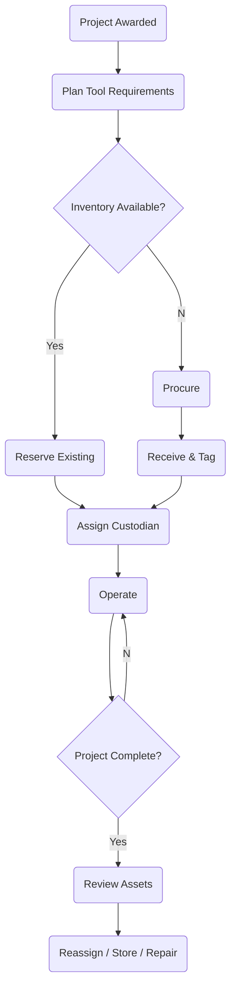

# STInventory — Internal Small Tools & Equipment Management

Master planning and functional specification for Urban Infraconstruction's internal
small-tools and equipment platform. Inspired by United Rentals' operating model, adapted
for an internal owner/custodian model rather than an external rental marketplace.

Status (2026-07-25): **partially built and running.** The asset register, custody
(assignments/transfers), vehicles, the notification engine, and an unplanned conversational
layer are live. Procurement and maintenance are not started. This document is the functional
target; for what actually exists today see:

- `03-data-model.md` Part A — the as-built schema (Part B is designed but unbuilt)
- `06-decisions.md` — architecture decisions taken during the build
- `07-conversational-layer.md` — the chat/intent subsystem, which was not in this plan
- §16 and §18 below — module-by-module and roadmap status

This is a standalone track; see §19 for how it relates to Mark 85 and the legacy stack.

---

## 1. Vision

A centralized platform that manages the full life of internally owned construction tools
and small equipment: procurement, inventory, custody, movement, maintenance, planning,
and reporting. One source of truth for "what do we own, where is it, who has it, what
project is it charged to, and is it working."

The United Rentals analogy: UR runs a rental catalog, branch inventory, dispatch, and
billing against jobsites. STInventory reuses that shape — catalog, warehouse inventory,
dispatch/transfer, and charge-to-project — but the "customer" is Urban's own foremen and
projects, and there is no external revenue transaction. Internal charge-back (§14) is the
optional analog of UR's billing.

## 2. Principles

- The Equipment Department owns all assets. Ownership never transfers.
- Foremen are custodians, not owners. Custody is assigned and revoked.
- Projects consume and use tools; they do not own them. They may be charged for them.
- Every movement is an immutable transaction. Nothing is edited in place.
- Current state (where/who/status) is derived from transaction history, never stored as
  the sole truth.
- Financial ownership (cost/charge-back) is tracked separately from operational custody.

## 3. Core Entities

| Entity | Role |
|---|---|
| Asset | A single owned tool/equipment unit (serialized) or a bulk/consumable line |
| Asset Category | Classification (power tools, hand tools, safety, survey, etc.) |
| Manufacturer / Model | Catalog reference for an asset |
| Warehouse / Storage Location | Physical place an asset can live |
| Project | A job the tool is deployed to and charged against |
| Project Phase | WBS/phase within a project, drives demand + reassignment |
| Foreman / Employee | A person who can hold custody |
| Assignment | Active custody link: asset ↔ custodian ↔ project ↔ location |
| Transfer | Movement of an asset between custodians/locations/projects |
| Purchase Request | Demand not covered by inventory, pending approval |
| Purchase Order | Approved buy sent to a vendor |
| Vendor | Supplier / repair shop |
| Maintenance Record | Preventive, corrective, calibration, warranty, damage |
| Inspection | Scheduled or event-driven condition check |
| Transaction Log | Immutable append-only event history (system of record) |

## 4. Domain Model

```
Equipment Department
  └─ Asset
      ├─ Assignment ── Foreman
      │             ── Project (+ Phase)
      │             ── Location
      ├─ Transactions  (append-only)
      ├─ Maintenance
      └─ Procurement   (PR → PO → Receive)
```

## 5. Asset Lifecycle

```
Requested → Approved → Purchased → Received → Tagged → Available
   → Assigned → Returned → [Maintenance] → Available
   → Disposed / Lost
```

Every arrow above is a Transaction event (§13). Status is the projection of the latest
events, not a hand-edited field.

## 6. Custody Model

```
Equipment Dept → Assignment → Foreman → Current Project → Physical Location
```

An Assignment record holds:

- Asset
- Custodian (Foreman/Employee)
- Project (and optionally Phase)
- Location
- Start date
- Expected end date
- Assignment type: Permanent or Temporary
- Status
- Approval

Invariants:

- One active custodian per serialized asset at a time.
- A foreman may hold many assets across many projects.
- Temporary assignments carry a due date and drive overdue alerts.

## 7. Operational Scenarios

These are the cases that make this harder than a spreadsheet. The system must handle each
explicitly.

### 7.1 Project completes
- Move tools with the foreman to their next project, or
- Return all tools to a warehouse, or
- Partial: some returned, some transferred to another foreman/project.

### 7.2 Foreman on multiple projects
Track, per foreman: primary project, current site/location, and each active assignment's
project. Tools do not all move just because the foreman moved.

### 7.3 Temporary loan / assignment
Assignment with a due date. Overdue → escalating alerts to foreman + equipment dept.

### 7.4 HR offboarding (foreman fired / leaves)
HR event triggers an equipment clearance workflow:
outstanding assets listed → inspect → return or transfer each → anything unaccounted marked
Missing → investigation → history retained. Clearance blocks final offboarding sign-off.

*Built:* the clearance **queue** (`dashboard.clearanceQueue`) derives outstanding assets from
`employee.employment_status = terminated`, and the dashboard surfaces it.
*Not built:* the BambooHR termination trigger (status is set by hand today), the inspection
step, and the **sign-off gate** — nothing currently blocks offboarding.

### 7.5 Phase changes
When a project phase ends, surface tools now idle for that phase → recommend return to
warehouse or transfer to projects/phases that need them.

### 7.6 Lost tools
Mark Missing → investigation → optional replacement (new PR) → history retained forever.

### 7.7 Damage
Inspection → repair (in-house or vendor) → warranty check → back to Available.

## 8. Procurement Workflow

```
Project Awarded → Estimate Tool Demand → Check Inventory
  → Reserve Existing Inventory → Identify Shortages
  → Purchase Request → Approval → Purchase Order
  → Receive → Inspect → Tag → Assign
```

Charge-to-project happens at purchase/receive (financial ownership) and is independent of
which foreman later holds custody.

## 9. Maintenance

Supports: preventive (scheduled), corrective (repair), calibration, warranty claims,
damage reporting, and inspection schedules. Each generates Maintenance/Inspection records
and Transaction events; a tool in maintenance is not Available and cannot be assigned.

## 10. Storage Locations

Hierarchy of places an asset can be:

- Main warehouse
- Regional warehouse
- Site container
- Gang box
- Vehicle (crew truck / trailer)

## 11. Planning & Forecasting

Demand forecast inputs:

- Project schedule / dates
- Project phase / WBS
- Tool templates (standard tool kit per work package)
- Supplier lead times
- Existing reservations
- Current inventory on hand

Output: reserve-vs-procure recommendations ahead of each project/phase start.

## 12. Reports (the moat — build these first per module)

Asset Register, Assets by Project, Assets by Foreman, Utilization, Idle Assets, Lost
Assets, Maintenance History, Procurement Status, Transfers, Audit Trail, Cost Allocation.

| Report | Status |
|---|---|
| Asset Register | Built — `report.assetRegister` |
| Assets by Project | Built — `report.byProject` |
| Assets by Foreman | Built — `report.byForeman` |
| Idle Assets | Built — `report.idle` |
| Lost Assets | Built — `report.lost` |
| Cost Allocation | Partial — `report.capitalByProject` covers capital by owning project only |
| Audit Trail | Built — via `transaction.list`, surfaced at `/d02/audit` |
| Utilization | Not built |
| Maintenance History | Not built (blocked on the maintenance module) |
| Procurement Status | Not built (blocked on the procurement module) |
| Transfers | Not built as a report; `transfer.list` exists |

> **The reports-first principle is currently being violated.** Six report procedures exist
> in `packages/api-contracts/src/routers/report.ts` and **none of them has a web page** —
> there is no Reports entry in the navigation (`apps/web/components/d02/d02-shell.tsx`).
> The moat is built in the API and invisible in the product. Closing this is the
> highest-value small piece of work outstanding.

## 13. Data & Events

Suggested tables:

Assets, Categories, Manufacturers, Assignments, AssignmentHistory, Projects,
ProjectPhases, Employees, Locations, Warehouses, PurchaseRequests, PurchaseOrders,
Vendors, Maintenance, Inspections, Transactions, Notifications.

Transaction (event) types:

Purchase, Receive, Assign, Transfer, Return, Repair, Inspection, Lost, Dispose,
CustodianChange, ProjectChange, LocationChange.

## 14. Permissions

Equipment Admin, Warehouse, Procurement, Project Manager, Foreman, HR, Finance, Read-only.

## 15. Dashboard KPIs

Available · Assigned · In Repair · Lost · Due Maintenance · Idle · Procurement Status ·
Upcoming Demand.

## 16. System Modules

| # | Module | Status | Notes |
|---|---|---|---|
| 1 | Dashboard | Built | KPIs, overdue loans, clearance queue, pending approvals, activity feed |
| 2 | Asset Register / Asset Management | Built | serialized + bulk, search/filter, status changes |
| 3 | Procurement | Not built | no PR/PO/vendor tables — `03-data-model.md` Part B |
| 4 | Warehouses & Locations | Built | incl. the nested location hierarchy |
| 5 | Projects (+ Phases) | Partial | phases exist as a table; no phase-level custody (`assignment` has no `phase_id`) |
| 6 | Foremen & Employees | Built | incl. org chart via `reports_to_employee_id` |
| 7 | Assignments | Built | permanent + temporary, overdue detection, approval gate |
| 8 | Transfers / Logistics | Built | approval gate on cross-person and high-value moves |
| 9 | Maintenance | Not built | no maintenance/inspection tables |
| 10 | HR Integration | Partial | clearance queue built; no BambooHR trigger, no sign-off gate (§7.4) |
| 11 | Planning & Forecasting | Not built | |
| 12 | Reporting | Partial | 6 procedures, **no UI** — see §12 |
| 13 | Administration | Partial | RBAC + `tenant_settings` built; no admin console |

Three modules exist in the product that this plan never listed:

| # | Module | Status | Notes |
|---|---|---|---|
| 14 | Vehicles / Fleet | Built | trucks and trailers as moving tracking locations with GPS |
| 15 | Messaging & Intent Capture | Built | chat → LLM intent → proposed custody action; see `07-conversational-layer.md` |
| 16 | Tasks | Built | work items extracted from chat that are not custody events |
| 17 | Verification Queue | Built | admin review of low-confidence and unresolved messages |

## 17. Process Flow



## 18. Roadmap

The original phase order was not followed. Custody (Phase 3) shipped before procurement
(Phase 2), because custody is what the spreadsheet fails at hardest and procurement can be
run on the existing process meanwhile. An unplanned conversational phase was inserted after
custody. Actual state:

| Phase | Scope | Status |
|---|---|---|
| 1 | Asset Register (catalog, tagging, current-state) | **Done** |
| 3 | Assignments & Transfers (custody + movement) | **Done** — taken ahead of Phase 2 |
| — | Vehicles as tracking locations | **Done** — unplanned |
| — | Conversational capture (chat → intent → custody action) | **Done** — unplanned; `07-conversational-layer.md` |
| 12 | Reporting | **Partial** — API built, no UI (§12) |
| 2 | Procurement (PR → PO → Receive) | Not started |
| 5 | Maintenance & Inspections | Not started |
| 4 | Mobile QR/barcode | Not started — Expo shell only, no scan flows |
| 10 | HR clearance sign-off gate + BambooHR trigger | Not started (§7.4) |
| 6 | Planning & Forecasting | Not started |
| 7 | ERP / Accounting integration (FoundationSoft charge-back) | Not started — `external_id` seams exist |
| 8 | RFID / BLE tracking | Not started |

Recommended next order: **reports UI → procurement → maintenance → mobile scan flows.**
Reports first because the API work is already paid for and invisible; procurement next
because it is the largest remaining hole in the lifecycle.

## 19. Relationship to Mark 85 and the legacy stack

STInventory is planned as a **separate track** for now — its own folder, its own scope,
its own roadmap. It is not part of the timesheet/legacy system and is not (yet) a Mark 85
module.

Intended convergence points (not commitments):

- Shared identities: Projects, Phases, Employees/Foremen already exist in Urban's world.
  STInventory should eventually read these from the same source Mark 85 uses rather than
  re-entering them.
- FoundationSoft is the accounting/cost-code system of record; charge-to-project and
  internal charge-back should route through it, matching Mark 85's integration boundary.
- HR offboarding (§7.4) needs an HR trigger — BambooHR today, potentially a Mark 85 HR
  module later.
- Design/UX must obey Urban's hard field-simplicity constraint: reports first, dumb-simple
  UI for foremen, mobile scanning over typing.

When Mark 85 matures, STInventory is a candidate to fold in as the Equipment/Small-Tools
module, or to stay a satellite app that shares Mark 85's data layer. Decide later.

## 20. Open Design Topics

- Financial ownership vs operational ownership — exact rule set.
- Internal rental / charge-back policy — flat, daily, or none.
- Tool templates by work package — who defines them.
- Multi-company support (Urban entities / Bodhi).
- Offline mobile workflow (yards/sites with no signal).
- Approval matrix for PR/PO and high-value custody. *(Partly resolved: custody approvals run
  off `tenant_settings.high_value_threshold` + `custody_approver_role`. PR/PO still open.)*
- Notifications & SLA (overdue, missing, maintenance-due). *(Resolved for overdue/missing;
  maintenance-due blocked on the maintenance module.)*
- Serialized assets vs bulk/consumable small tools — one model or two. *(Resolved: one
  model, with `is_serialized` + `quantity` on `asset`.)*

Raised during the build, still open:

- **`project_phase` has no `tenant_id`** — blocks RLS and therefore tenant two. See
  `02-saas-architecture.md` §5.
- **Reports have no UI** — six procedures, zero pages. See §12.
- **Phase-level custody** — `assignment` has no `phase_id`, so §7.5 phase-change detection
  runs off project dates rather than the assignment itself. Add the column or accept the
  looser rule.
- **Auto-execute policy for chat intents** — how much should the system do without a human
  confirming? See `07-conversational-layer.md`.
- **LLM hosting** — the intent engine currently expects a local OpenAI-compatible endpoint.
  Self-hosted vs. hosted API is undecided and has cost, latency, and data-residency
  consequences.
