# STInventory — Diagrams

All diagrams are Mermaid (render in GitHub, VS Code with a Mermaid extension, or any
Mermaid live editor). Grouped by concern: domain, lifecycle, custody flows, procurement,
architecture, and SaaS multi-tenancy.

---

## 1. Entity relationship — as built

Tables that exist in `packages/db/src/schema/`. Physical names are singular and snake_case.
The planned-but-unbuilt procurement and maintenance tables are in §1b.

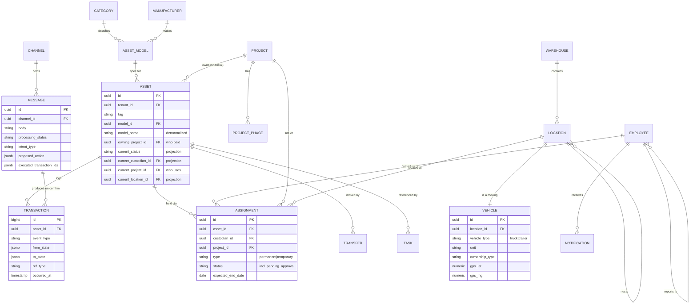

Identity and RBAC sit alongside the domain, keyed by `tenant`:

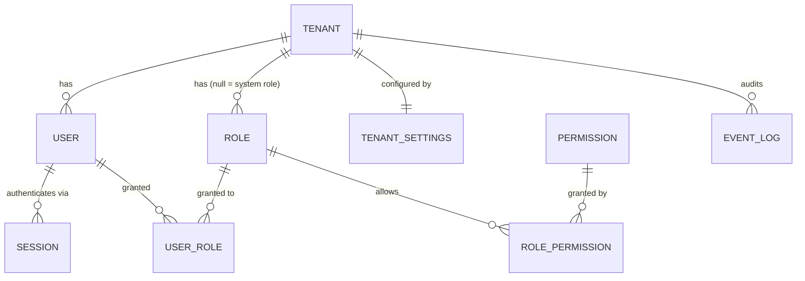

> `user.employee_id` is a plain uuid with **no FK**, to keep the schema import graph acyclic;
> the link is resolved in the API layer. `event_log` is generic access audit — the domain
> system of record is `TRANSACTION`.

## 1b. Entity relationship — planned, not built

No migration exists for any of these. See `03-data-model.md` Part B.

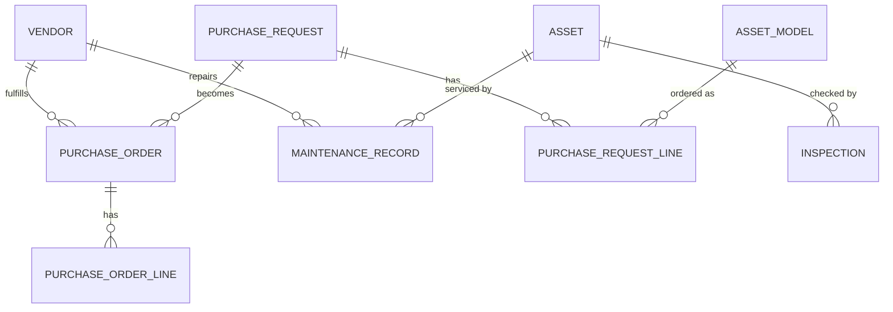

## 2. Asset lifecycle (state machine)

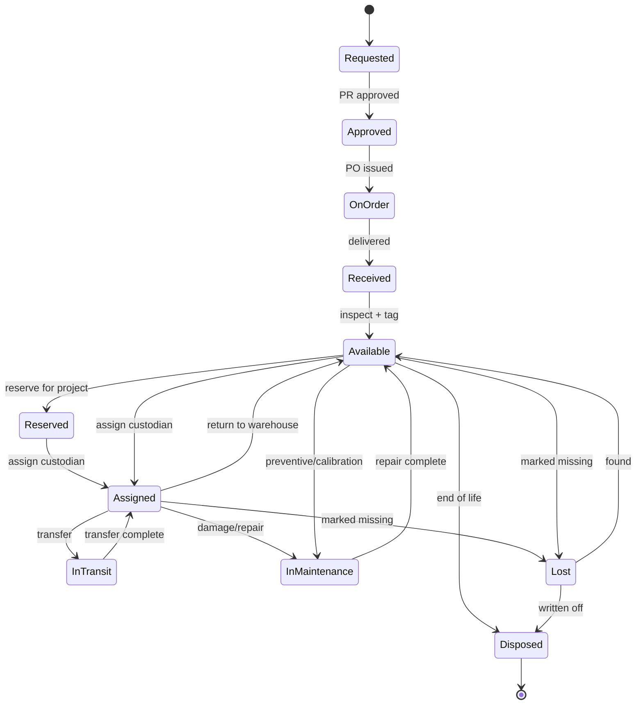

## 3. Custody model (who/what/where)

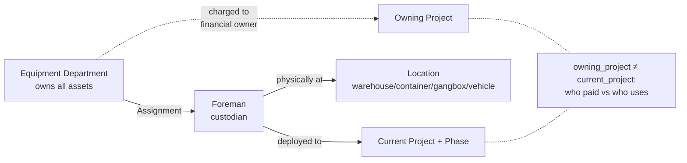

## 4. Scenario — foreman on multiple projects

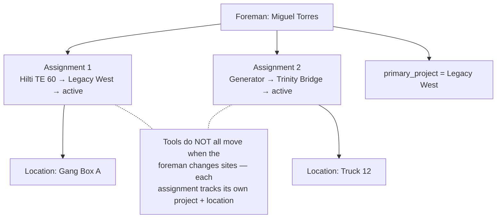

## 5. Scenario — HR offboarding / foreman fired

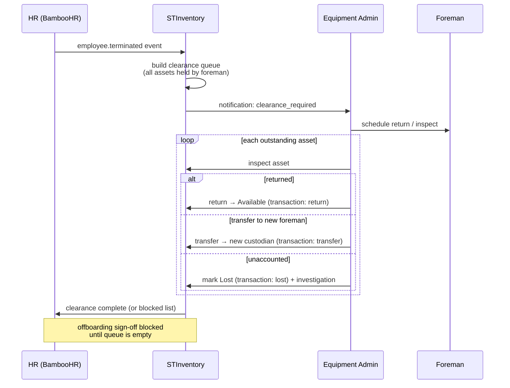

## 6. Scenario — project complete / phase change

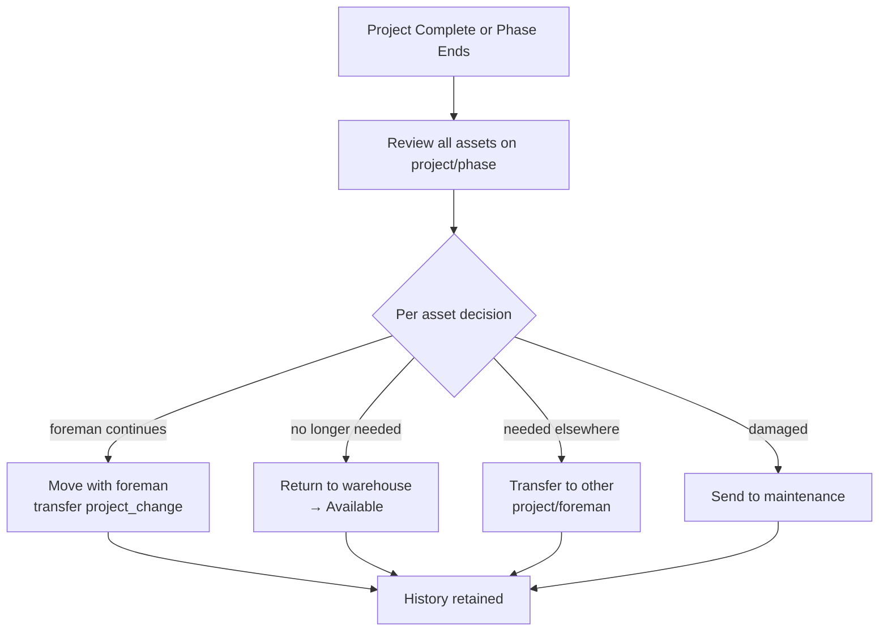

## 7. Procurement workflow (BPMN-style)

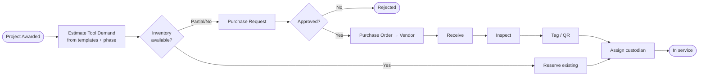

## 8. Deployment architecture (as built)

Dashed edges are planned and have no code behind them.

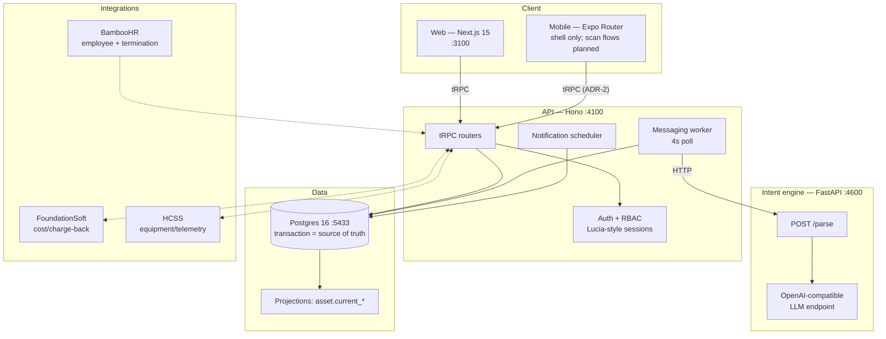

> The engine is **not** in `docker-compose.yml` (postgres, api, web only). In a containerized
> run the worker cannot reach it and every message falls to `pending_manual`.

## 9. SaaS multi-tenancy

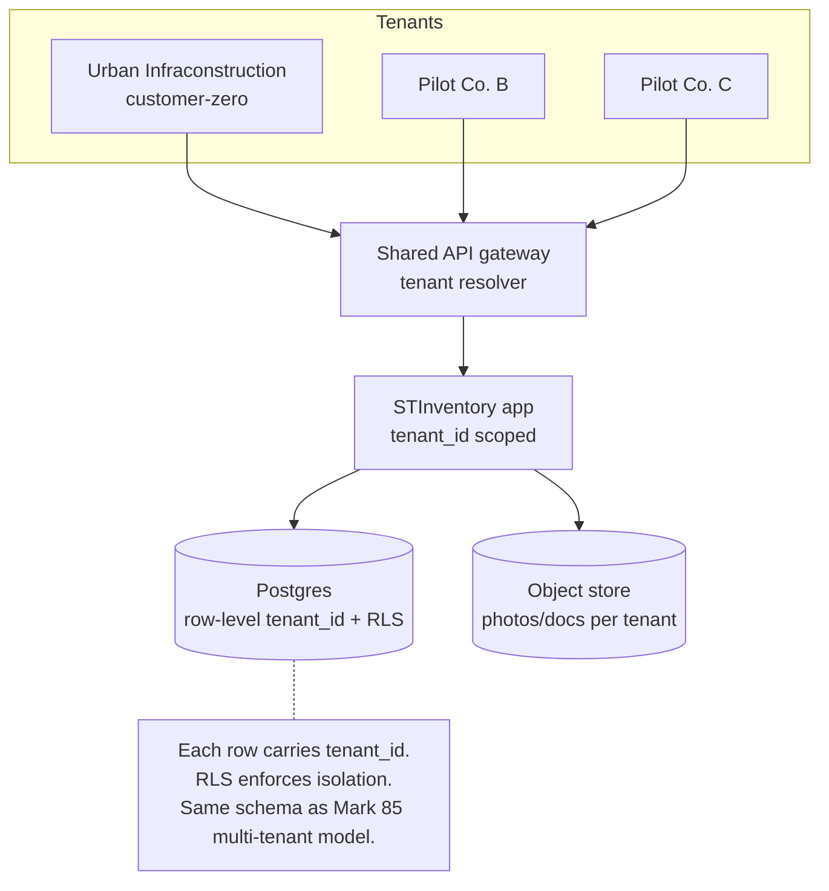

## 10. Chat message → custody transaction

The core loop of the conversational layer (`07-conversational-layer.md`). Note that the LLM
returns **raw text spans only** — resolution to database IDs happens in the API, tenant-scoped,
which is why a hallucinated identifier cannot address a real row.

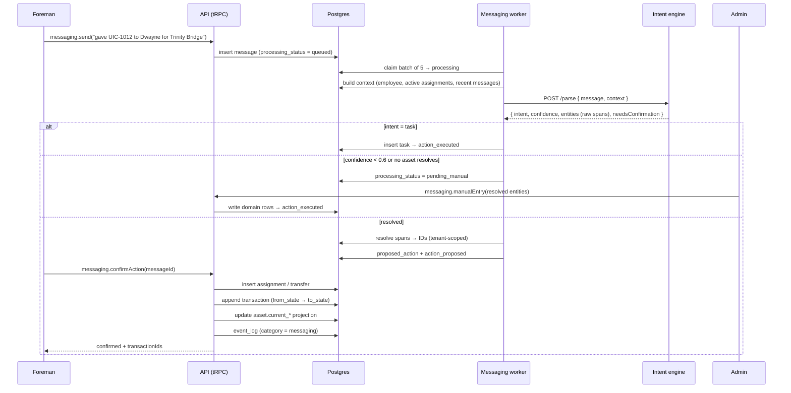

> Gap to be aware of when reading this diagram: `confirmAction` implements only `assign`,
> `return`, and `transfer`. A confirmed `repair` or `lost` writes nothing yet still reports
> success — see `07-conversational-layer.md` §7.

## 11. How current-state is derived (event fold)

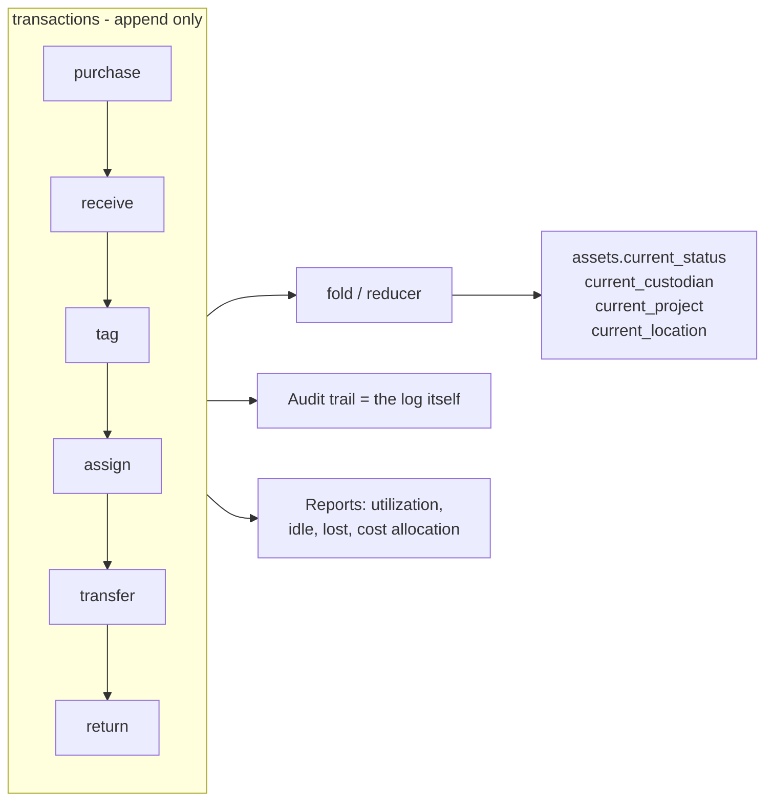
