# Data model

**Derived from `packages/db/src/schema/*.ts`, which is the authority.** Where this
document and the schema disagree, the schema is right and this document is a bug.
The foreign-key graph below was extracted from the `.references()` calls rather
than transcribed, so it is complete as of the date on the changelog that
introduced it.

Superseded `docs/03-data-model.md`, now in `archive/`. That document described
tables by their pre-2026-08-28 names — `asset`, `assignment`, `transaction` — none
of which exist any more.

## The naming convention

Every table carries a prefix naming what kind of thing it is:

| Prefix | Meaning |
|---|---|
| `tbl_entity_` | A thing that exists in the world — a tool, a person, a project, a role |
| `tbl_ops_` | Something that *happened* or is happening — a custody, a transfer, a ledger entry, a message |

`tbl_ops_smalltools_custody` is the clearest case of why the split earns its
place: it is an operation belonging to the equipment department, joining an entity
(the tool) to another entity (the person), and its name says so.

The repo, the package scope `@stinventory/*`, the seeded `*.local` email domain
and the `sti-*` browser storage keys all still say STInventory. That is deliberate
and is not drift — see `CLAUDE.md`.

## The one idea

**Where a tool is, is calculated. It is never typed into a field.**

`tbl_ops_transaction` is an append-only ledger and is the system of record. Every
`tbl_entity_asset.current_*` column is a *projection* of that ledger — a cache,
maintained for query speed, rebuildable from the events at any time. When the two
disagree, the ledger is right and the projection has a bug in a writer.

Two consequences that the schema cannot enforce and the code must:

- **Every ledger write carries a complete `to_state` snapshot.** The fold
  replaces; it does not merge. A partial snapshot does not mean "only the status
  changed" — it means custodian, project and location are now undefined, and a
  rebuild will blank them.
- **Ownership and custody are separate axes.** `owning_department_id` and
  `owning_project_id` record who paid. `current_custodian_id` records who is
  holding it now. A tool follows the person, not the site.

`.claude/rules/custody-and-ledger.md` is the operational version of this and is
required reading before touching either table.

## Tenancy

Every tenant-scoped table carries `tenant_id` referencing `tbl_entity_tenant`.

**There is no row-level security.** The `WHERE` clause *is* the isolation: every
query carries `eq(table.tenantId, tid)`. A query that forgets it is a cross-tenant
data leak, not a performance problem. `tenant-predicate.test.ts` and
`tenant-scoped-login.test.ts` exist to make that fail loudly.

Two tables are deliberately tenant-free: `tbl_entity_permission` (the catalogue of
permission names, which is platform-wide) and `tbl_entity_role_permission` /
`tbl_entity_user_role` (join tables keyed by rows that are themselves scoped).

## Entity relationships

```mermaid
erDiagram
    tbl_entity_tenant ||--o{ tbl_entity_user : "has"
    tbl_entity_tenant ||--o{ tbl_entity_employee : "has"
    tbl_entity_tenant ||--o{ tbl_entity_project : "has"
    tbl_entity_tenant ||--o{ tbl_entity_asset : "has"

    tbl_entity_user ||--o{ tbl_entity_session : "signs in with"
    tbl_entity_user ||--o{ tbl_entity_auth_token : "invited or reset by"
    tbl_entity_user ||--|| tbl_entity_user_preferences : "appearance"
    tbl_entity_user ||--o{ tbl_entity_user_role : "granted"
    tbl_entity_role ||--o{ tbl_entity_user_role : "grants"
    tbl_entity_role ||--o{ tbl_entity_role_permission : "carries"
    tbl_entity_permission ||--o{ tbl_entity_role_permission : "named by"

    tbl_entity_employee }o--|| tbl_entity_role : "system role"
    tbl_entity_employee }o--|| tbl_entity_company_role : "company role"
    tbl_entity_employee }o--o| tbl_entity_project : "primary project"
    tbl_entity_employee ||--o{ tbl_entity_employee_contact : "phone and email"

    tbl_entity_asset }o--o| tbl_entity_asset_model : "model"
    tbl_entity_asset_model }o--o| tbl_entity_category : "category"
    tbl_entity_asset_model }o--o| tbl_entity_manufacturer : "make"
    tbl_entity_asset }o--o| tbl_entity_department : "owned by"
    tbl_entity_asset }o--o| tbl_entity_project : "owned by"
    tbl_entity_asset }o--o| tbl_entity_employee : "current custodian"
    tbl_entity_asset }o--o| tbl_entity_location : "current location"

    tbl_entity_location }o--o| tbl_entity_warehouse : "in"
    tbl_entity_location }o--o| tbl_entity_project : "on"
    tbl_entity_location }o--o| tbl_entity_employee : "custodian"
    tbl_entity_vehicle }o--o| tbl_entity_location : "parked at"
    tbl_entity_vehicle }o--o| tbl_entity_employee : "foreman"
    tbl_entity_vehicle }o--o| tbl_entity_project : "assigned to"

    tbl_ops_smalltools_custody }o--|| tbl_entity_asset : "of"
    tbl_ops_smalltools_custody }o--o| tbl_entity_employee : "to"
    tbl_ops_smalltools_custody }o--o| tbl_entity_project : "charged to"
    tbl_ops_smalltools_custody }o--o| tbl_entity_location : "at"
    tbl_ops_transfer }o--|| tbl_entity_asset : "of"
    tbl_ops_transaction }o--|| tbl_entity_asset : "about"

    tbl_ops_employee_project_assignment }o--|| tbl_entity_employee : "posts"
    tbl_ops_employee_project_assignment }o--|| tbl_entity_project : "to"
    tbl_ops_project_team_member }o--|| tbl_entity_project : "team of"
    tbl_ops_project_team_member }o--|| tbl_entity_employee : "member"

    tbl_ops_channel ||--o{ tbl_ops_message : "carries"
    tbl_ops_message }o--o| tbl_entity_employee : "from"
    tbl_ops_task }o--o| tbl_entity_asset : "about"
    tbl_ops_notification }o--o| tbl_entity_user : "to"

    tbl_entity_project_group ||--o{ tbl_entity_project_group_project : "contains"
    tbl_entity_project_group ||--o{ tbl_entity_project_group_user : "visible to"
    tbl_entity_uom_category ||--o{ tbl_entity_unit_of_measure : "groups"
```

The diagram is a map, not a specification. Cardinalities are drawn from the
nullability of the referencing column; the columns themselves are in the schema
files, each with a comment explaining what it is for.

## The tables, by area

### Identity, tenancy and access — `schema/identity.ts`

`tbl_entity_tenant`, `tbl_entity_tenant_settings`, `tbl_entity_user`,
`tbl_entity_session`, `tbl_entity_auth_token`, `tbl_entity_user_preferences`,
`tbl_entity_role`, `tbl_entity_permission`, `tbl_entity_role_permission`,
`tbl_entity_user_role`.

**A login is a property of a person, not a separate register.** There was once a
`/admin/users` screen listing the same people a second time; it was deleted on
2026-08-28. `tbl_entity_user` carries `email_verified_at` and `last_sign_in_at` so
the People screen can say what a person's login is actually doing without a second
table to reconcile.

`tbl_entity_role` carries behavioural flags as well as permissions:
`needs_login` (a labourer who will never sign in is not an outstanding
invitation), `can_hold_custody`, `uses_field_layout`, `is_system`.

`tbl_entity_auth_token` is a table rather than a flag on the user row, and the
reason is in its comment: an invite is issued to somebody with no account yet and
a reset to somebody locked out of the one they have. Neither can be expressed by a
boolean on a row the recipient cannot reach.

### Catalogue — `schema/catalog.ts`

`tbl_entity_category`, `tbl_entity_manufacturer`, `tbl_entity_asset_model`. What a
tool *is*, separate from which particular one it is.

### Reference data — `schema/reference.ts`

`tbl_entity_uom_category`, `tbl_entity_unit_of_measure`, `tbl_entity_company_role`.
Units of measurement grouped by kind (length, mass), and the company's own job
titles — which are not the same thing as system roles and must not be conflated
with them.

### People and org — `schema/employee.ts`, `schema/department.ts`

`tbl_entity_employee`, `tbl_entity_employee_contact`, `tbl_entity_department`,
`tbl_ops_employee_project_assignment`, `tbl_ops_project_team_member`.

**`tbl_ops_project_team_member.source` records which system wrote the roster
row** — see `TEAM_SOURCES` in `packages/types`, defaulting to
`equipment_department`. It is descriptive and nothing branches on it. Urban's
crews are keyed differently in the equipment department, in payroll, and in
whatever arrives next, so when two of them disagree about who is on a job the
reconciliation has to know which one wrote the row. That is unanswerable
retrospectively, which is why the column landed before a second writer existed.

**`tbl_entity_employee.external_id` is the HR-issued employee ID, and it is a
naming trap.** Urban sometimes calls that identifier "contact". It has nothing to
do with `tbl_entity_employee_contact`, which holds phone numbers and email
addresses. The schema comment says so at the column; do not let the two meet.

`tbl_entity_employee.role_id` is the source of truth for a person's system role;
`company_role_id` is their job title. The two are separate columns because they
answer different questions and change at different times.

### Places and fleet — `schema/location.ts`

`tbl_entity_warehouse`, `tbl_entity_location`, `tbl_entity_vehicle`.

Trucks and trailers are equipment *and* moving locations. A tool "in TE-006" is
recorded through the vehicle columns on the custody row, not through a location
row — see below.

### Projects — `schema/project.ts`, `schema/projectGroup.ts`

`tbl_entity_project`, `tbl_entity_project_group`,
`tbl_entity_project_group_project`, `tbl_entity_project_group_user`.

A project has a project code and a project name, strictly. Groups are a saved
selection of jobs plus who can see it — a convenience for the switcher, never an
access control.

### The register — `schema/asset.ts`

`tbl_entity_asset`, `tbl_ops_smalltools_custody`, `tbl_ops_transfer`.

`tbl_ops_smalltools_custody` carries `truck_id` and `trailer_id` with **composite
foreign keys** (`assignment_truck_fk`, `assignment_trailer_fk`) pairing the id with
a `vehicle_type`, so a trailer cannot be recorded in the truck column. Those keys
are **tenant-blind** — the target unique index carries no tenant component — so
`assertVehicleContext` in `custody.ts` is the gate that stops one tenant naming
another's truck. The FK will not do it for you.

A partial unique index `assignment_one_active_uq` allows only one active custody
per asset. It is a backstop that makes a bypass fail loudly; it cannot *close* the
previous row, which is why `packages/api-contracts/src/custody.ts` remains the one
legitimate writer.

### The ledger and the log — `schema/event.ts`, `schema/audit.ts`

`tbl_ops_transaction` (append-only, enforced by a trigger), `tbl_ops_event_log`,
`tbl_ops_notification`.

### Conversation and work — `schema/messaging.ts`, `schema/task.ts`

`tbl_ops_channel`, `tbl_ops_message`, `tbl_ops_task`.

## Migrations

Hand-written SQL under `packages/db/drizzle`, applied by `make migrate`.
`make generate` diffs the schema and emits the next file; `push` is deliberately
named `push-dangerous` and is not the workflow.

**Two failure modes have cost real time and are worth knowing before you touch
this directory.** A rename prompts `drizzle-kit generate` interactively and will
hang, then emit DROP+CREATE if answered wrong — the 2026-08-28 table rename was
hand-written for exactly that reason. And a merge that drops an entry from
`meta/_journal.json` produces a migration that exists but never runs, because
`migrate` reads only the journal while `generate` diffs only the newest snapshot.
Check both after any merge touching that directory.
