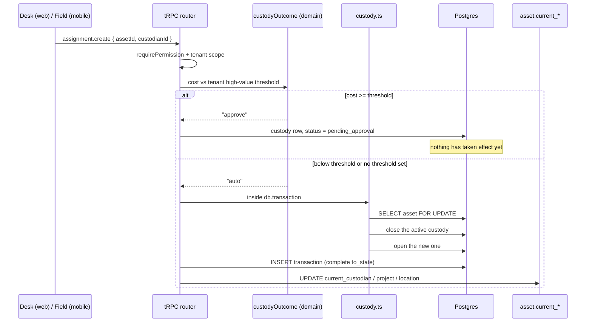
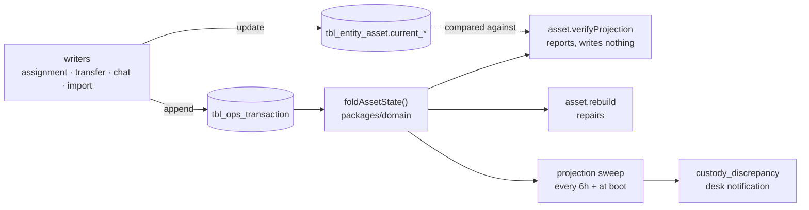
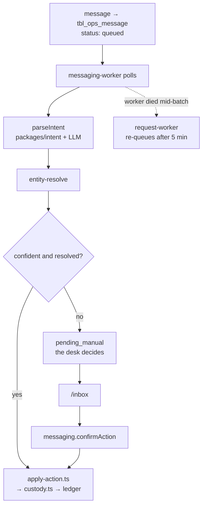
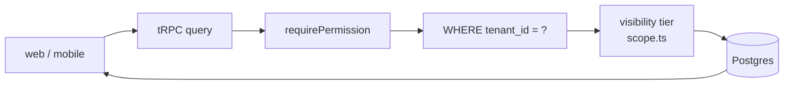

# Data flow

How a fact gets into the system, and how it gets back out. Four flows carry
essentially everything.

## 1. A tool changes hands

The core loop. Everything else is a variation on it.

Three things this diagram is drawing attention to:

**The asset row is locked first**, before anything is read or written, because it
exists even when no custody row does. Two moves on one tool queue rather than both
opening a link.

**The ledger insert carries a complete `to_state`.** Not a delta. The fold replaces
rather than merges, so a partial snapshot means custodian, project and location are
now *undefined* and a rebuild will blank them. This has shipped as a bug three
times.

**The projection update and the ledger insert are in the same transaction** as the
close-and-open. They commit together or vanish together; a register that disagrees
with its ledger is the failure this prevents.

Approval is where the second branch rejoins the first: `assignment.approve` closes
the prior link inside its own transaction, re-checking status under the lock.

## 2. The ledger is the truth, the register is a cache

**Compare and repair are separate actions, deliberately.**
`asset.verifyProjection` writes nothing and reports divergence — and an empty fold
*is* a divergence, which must never be softened, because making that visible is
the whole reason it exists. `asset.rebuild` repairs, and **skips** assets whose
ledger carries no snapshot: an initial state is indistinguishable from "no
evidence", and blanking a live row on no evidence turns the repair into the
corruption.

There is one fold. `asset.rebuild` and the reconciliation checker both call
`foldAssetState` — the inline reimplementation that used to sit in the router is
gone, so the tested code and the production code are the same code rather than two
implementations that happened to agree.

**When a screen shows the wrong custodian, read the ledger, not the projection.** A
wrong `current_*` value is evidence about a *writer*. Patching it in place hides
the bug and the sweep will raise it again in six hours.

## 3. A foreman says something in chat

A message stuck in `pending_manual` means one of three things and it is worth
checking in this order: no model is configured, confidence was below the bar, or
no asset could be resolved.

The two chat sign-off paths use **claim-then-act** rather than a held lock, and
the reason is specific: a pending action can name several assets or none, so no
single asset row can anchor a re-check; and `applyChatAction` opens its own
transaction, so holding one across it wedges the connection pool. One conditional
`UPDATE … WHERE still confirmable` is the claim; racing claims serialise inside
that statement and the loser raises a conflict.

## 4. Reading it back

Three gates, every time, and they are not interchangeable:

1. **The permission** answers "may this role do this at all".
2. **The tenant predicate** answers "whose data is this". There is no RLS — the
   `WHERE` clause *is* the isolation.
3. **The visibility tier** (`scope.ts`) answers "how much of their own tenant's
   data does this person see" — a foreman sees their own holdings, the desk sees
   the yard.

Reports and dashboard tiles are ordinary queries through the same three gates. The
job-scope filter in the browser narrows what is *displayed* and is a convenience,
never a fourth gate.

## Where things enter the system

| Entry point | Path |
|---|---|
| The desk types it | web form → tRPC mutation → chokepoint → ledger |
| The field says it | chat → worker → intent → action → chokepoint → ledger |
| A spreadsheet | `import.preview` → validation → `import.commit` → baseline events |
| The seed | `packages/db/src/seed.ts` — including the edges that trip the rules |
| A photo | `POST /assets/:id/photo` → storage → asset row |

**The seed is part of the system, not a fixture.** Data the seed cannot produce is
behaviour nobody tests: it carried no acquisition costs once, so the high-value
approval gate could not be exercised without hand-editing rows, and its ledger
rows carried no `to_state`, so the fold was a no-op on every asset in the
database. When you add a threshold, a status, a role or a state, seed something
that reaches it — including the edge that trips the rule, not just the happy path.
