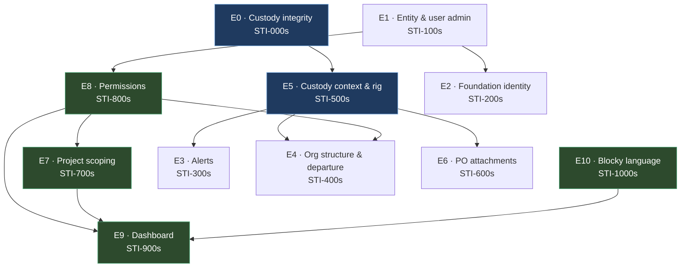

# Release 1 — Sprint Plan

**Sprint 1 target:** 24 August 2026 — six working days · **Owner:** Product · **Audience:** the delivery team
**Companion documents:** `docs/workings/SYSTEM_PLAN.md` (what the system is), `design/README.md` (the two UI concepts)

This is the handover document. It converts the eleven agreed deliverables into epics,
stories, and tasks with acceptance criteria, sequencing, and the mechanism each one
implements. Machine-readable copies for import sit beside it:

- `jira-import.csv` — Jira CSV importer, validated against the **`UI` Scrum project**.
  No Issue Key column (Jira assigns them), epics linked by Epic Name, `Original Estimate`
  in hours, and the plan ID carried in the summary as `[STI-nnn]` plus a label so an
  imported `UI-42` stays traceable to this document.
  **Sprint travels as a label** (`sprint-1`, `sprint-2`, …), not as a Sprint column — the
  importer requires numeric sprint ids, which do not exist until the sprints are created
  on the board. Import first, then bulk-move each label into its sprint from the backlog
- `jira-import.json` — same content, structured, for the REST API or scripting
- `gen-jira.js` — generates both from one source. **Edit the plan, then regenerate.**
  It refuses to emit if epic totals disagree, a dependency points at a later sprint, or
  Sprint 1 exceeds its capacity ceiling.

> **The whole backlog is 772 hours — about 96 developer-days. Six working days buys 160
> hours.** §14 sets out
> exactly what ships on the 24th and what is scheduled after it. Everything in this
> document is specified in full regardless of sprint, so nothing needs re-analysis when
> it comes up the queue.

---

## 1. How to read a story

Every story ID is stable and self-describing: `STI-<epic><nn>`. The epic digit never
changes, so `STI-4xx` is always custody context. Sub-tasks are `STI-<parent>-<n>`.

**Sizing is in hours**, because Urban's Jira is time-tracked rather than point-based.
Estimates are drawn from one table so they stay comparable — the team argues about relative
size, and the hours follow:

| Relative size | Estimate | Reads as |
|---|---|---|
| XS | 3h | a couple of hours |
| S | 5h | half a day |
| M | 8h | a day |
| L | 16h | two days |
| XL | 20h | two and a half days |
| XXL | 32h | four days — **split it if it grows** |

An 8-hour day and a 5-day week. `gen-jira.js` derives every Jira `Original Estimate` from
this table, so the document and the board cannot disagree.

Each story carries:

- **Mechanism** — how it works, not what it looks like. Read this before the AC.
- **AC** — acceptance criteria, written so QA can fail the story without asking anyone.
- **Cases** — the edge cases that have already bitten us or will.

A story is **done when it is reachable**. A correct procedure with no caller is not
delivered — this is the single most expensive lesson from the last cycle, where the desk
queue shipped as backend-only and nobody could run it.

---

## 2. Deliverable → epic map

The eleven deliverables do not map one-to-one onto epics, because three of them
(6, 7, 8) are the same schema problem seen from different angles and one of them (11)
runs through every screen. The mapping:

| # | Deliverable | Epic | Est |
|---|---|---|---|
| 1 | Entity management — projects, equipment, users, small tools | **E1 · STI-100s** Entity & user administration | 96h |
| 2 | Foundation sync | **E2 · STI-200s** Foundation identity & load | 76h |
| 3 | Notifications & critical alerts | **E3 · STI-300s** Alerts & assignment gaps | 60h |
| 4 | Equipment dept / PM / superintendent management views | **E4 · STI-400s** Org structure & departure | 92h |
| 6, 7 | Backtrack tool → trailer → truck → PO; drop redundant structure | **E5 · STI-500s** Custody context & rig model | 80h |
| 5 | Purchase order attachments | **E6 · STI-600s** Purchase order attachments | 44h |
| 8 | Company unique identifiers, redundancy-safe import | *folded into E2* | — |
| 10 | Project / project-group scoped views | **E7 · STI-700s** Project scoping | 40h |
| 11 | Role-based permission and view | **E8 · STI-800s** Permissions & role surfaces | 76h |
| 9 | Custom + generated dashboard | **E9 · STI-900s** Dashboard tabs & generated views | 92h |
| — | Foundations the above rest on | **E0 · STI-000s** Custody integrity | 64h |
| — | Blocky visual language (ADR-7) | **E10 · STI-1000s** Blocky design language | 52h |

**Total: 772 hours (96.5 developer-days)**, of which **160 hours — exactly the six-day
capacity — are committed to Sprint 1 (24 August)** and the rest is scheduled into S2–S4. See §14 for the sprint breakdown, the day-by-day plan, and the
completion date for the full eleven.

Every story below is specified in full whatever its sprint. A story coming up the queue in
September should need no fresh analysis — only a look at whether the codebase has moved
under it.

---

## 3. Sequencing — what blocks what



**Three things must land on time or the sprint slips.** These are the §14 checkpoints:

1. **Day 2 — STI-801, the permission matrix agreed with Urban.** Everything role-shaped
   waits on it, and all of Sprint 2 is blocked behind it. It is a meeting, not a build
   task, and it is the top risk in §15.
2. **Day 3 — STI-501, assignment gains `truck_id` and `trailer_id`.** STI-301, STI-502 and
   STI-503 all sit behind it. A day late here costs three stories.
3. **Day 4 — STI-002, the duplicate-assignment backfill.** It needs the Equipment
   department in the room making per-tool judgements. Book that time in week 1, not on day 4.

---

# Epic 0 · Custody integrity — `STI-000s`

**64 hours (8 developer-days).** Not one of the eleven deliverables, and non-negotiable anyway. Every
deliverable below reads custody state. Four defects currently make that state
untrustworthy, and building reporting on top of them multiplies the error.

### STI-001 — Make custody writes atomic · **16h** (2d) · `SPRINT 1`

**Mechanism.** Custody currently executes three consecutive unwrapped statements: close
the old assignment, open the new one, append the ledger event. A failure between any two
leaves the register and the ledger disagreeing, permanently and silently. The import path
already does this correctly inside a transaction; custody does not. Wrap it, take a row
lock so two concurrent writers cannot interleave, and validate the transition against the
pure rules in `packages/domain` before writing anything.

```python
def apply_custody_change(actor, asset, action, context):
    require_permission(actor, action)

    with db.transaction() as tx:                     # invariant 3
        current = tx.lock_for_update(active_assignment(asset))   # SELECT ... FOR UPDATE
        validate_transition(current.state, action)   # pure, packages/domain

        tx.close_assignment(current)
        new = tx.open_assignment(
            asset   = asset,
            holder  = context.holder,
            project = context.project,
            truck   = context.truck,                 # STI-501
            trailer = context.trailer,
        )
        tx.append_ledger(                            # complete to_state, always
            asset    = asset,
            action   = action,
            actor    = actor,
            snapshot = new.to_snapshot(),
            occurred = now(),
        )
        tx.update_projection(asset, new)
    notify_desk_if_pending(new)                      # outside the tx, deliberately
    return new
```

**AC**
- Every caller — `assignment.create`, `transfer.create`, `transfer.approve`, the chat
  executor, and the import commit — routes through this one function.
- An injected failure at each of the three write points leaves the database unchanged.
- The ledger event carries a **complete** `to_state`. `foldAssetState` is
  last-snapshot-wins, not field-wise; a partial snapshot silently erases fields. This bug
  has shipped twice.
- Notification dispatch happens after commit. A failing notifier must not roll back custody.

**Cases**
- Two desk operators assign the same tool simultaneously → one wins, one gets a clean
  conflict error, no duplicate active row.
- Asset has no active assignment (first issue from the yard) → `current` is null and the
  transition validator accepts it.

### STI-002 — One active assignment per asset, enforced at the database · **16h** (2d) · `SPRINT 1`

**Mechanism.** The invariant is stated in three documents and enforced nowhere. Duplicates
already exist in live data, so the index cannot simply be added — the backfill has to
choose a survivor first.

```sql
-- Find them first. This query is the input to the backfill session.
SELECT asset_id, count(*) FROM assignment
 WHERE status = 'active' GROUP BY 1 HAVING count(*) > 1;

CREATE UNIQUE INDEX CONCURRENTLY assignment_one_active_uq
  ON assignment (asset_id) WHERE status = 'active';
```

**AC**
- The duplicate report is produced and reviewed **with the Equipment department** before
  any row is touched. Which of two active assignments survives is a per-tool judgement
  about where the tool physically is. It is not a script and must not be automated.
- Each correction is written as a **compensating ledger event**, never an `UPDATE` or
  `DELETE` on history.
- The index exists and a second active insert fails at the database, not in application code.
- `CONCURRENTLY` so the migration does not lock the table.

**Cases**
- Backfill discovers a tool nobody can locate → it becomes `lost`, which is a real state,
  rather than being force-assigned to whoever appears first in the table.

### STI-003 — Make the ledger append-only at the database · **8h** (1d) · `S1 STRETCH`

**Mechanism.** "Append-only" is currently a code comment. Revoke the grants so it is a
property of the database instead.

```sql
REVOKE UPDATE, DELETE ON transaction FROM app_role;
```

**AC** Application `UPDATE`/`DELETE` against `transaction` fails. Migrations run under a
role that still holds DDL rights. A rejected write surfaces as a typed error, not a 500.

### STI-004 — Scheduled projection reconciliation · **16h** (2d) · `S1 STRETCH`

**Mechanism.** Invariant 4 says folding the ledger from the beginning reproduces the
current register exactly. Nothing proves it today. A scheduled job folds and compares.

```python
def verify_projection():
    divergent = []
    for asset in all_assets():
        folded = fold(ledger_events_for(asset))      # pure, packages/domain
        if folded != projection_for(asset):
            divergent.append((asset, folded, projection_for(asset)))
    report(divergent)                                # must be empty
```

**AC** Runs nightly. A non-empty result raises a desk alert naming the assets. The job is
read-only — it reports drift, it never silently repairs it, because a silent repair
destroys the evidence of the bug that caused the drift.

### STI-005 — Commit outstanding migrations, fail CI on drift · **8h** (1d) · `SPRINT 1`

**Mechanism.** Two migrations are uncommitted, so production may not match `main`. CI
should have caught it.

**AC** Migrations committed; deployed schema verified against `main`; CI job fails when
`drizzle generate` produces a non-empty diff. This is free and should be done on day 1.

---

# Epic 1 · Entity & user administration — `STI-100s`

**96 hours (12 developer-days).** Deliverable 1. Master data CRUD largely exists — tools, categories,
projects, employees, locations, trucks, trailers. **User administration does not exist at
all**, and four of the ten declared roles cannot log in. That is the epic.

### STI-101 — User administration · **20h** (2.5d) · `SPRINT 1`

**Mechanism.** There is no screen for creating a user, granting a role, deactivating
someone, or resetting a password. Every account today came from the seed. Build the
CRUD over the existing `user` / `role` / `user_role` tables.

**AC**
- Create user (email, employee link, role), assign/revoke roles, deactivate, reset password.
- Deactivation **ends sessions immediately** — a deactivated user with a live token is a
  departed employee still holding access.
- Deactivating a user who holds tools is refused, and the error names STI-402 (departure
  reassignment) as the path. Custody must land somewhere before access is removed.
- Password reset issues a single-use, expiring token. bcrypt cost 12, matching login.
- Every action writes an audit event with the acting user.

**Cases**
- Last owner account cannot be deactivated or stripped of its role — a tenant with no
  administrator is unrecoverable.
- Email already in use → typed field error, not a constraint violation surfacing as a 500.

### STI-102 — The missing login roles · **16h** (2d) · `SPRINT 3`

**Mechanism.** `ROLES` declares ten: `owner`, `equipment_admin`, `warehouse`,
`procurement`, `project_manager`, `superintendent`, `foreman`, `hr`, `finance`,
`read_only`. `ROLE_PERMS` in the seed covers only some of them, so the rest cannot log in
usefully. Separately, `mechanic` exists as an **employee** role but not as a **login**
role — and a mechanic holds tools, so they need custody visibility.

**AC**
- Every role in `ROLES` has an explicit permission set. No role falls through to empty.
- `mechanic` is added as a login role with custody-read plus repair actions.
- `system_administrator`, `office_administrator` and `equipment_administrator` are
  **distinct** roles. "Admin" resolving to one role in code is the single most dangerous
  ambiguity in Urban's vocabulary — see SYSTEM_PLAN §2.
- Depends on STI-801.

### STI-103 — Equipment entity management: trucks and trailers · **16h** (2d) · `SPRINT 4`

**Mechanism.** Trucks and trailers are `vehicle` rows 1:1 with a `location` row. CRUD
exists but the desk cannot see fleet-wide state or find an unassigned unit. Note the scope
boundary: **these are moving locations for tools, not a fleet module.** No maintenance
schedules, no mileage, no fuel.

**AC**
- List/filter by type, ownership (`company_owned` | `personal_allowance`), assignment status.
- "Unassigned" is a first-class filter — it is what the desk actually searches for.
- Personal vehicles are visually distinct everywhere. They are not Urban property and
  behave differently on departure (STI-402).
- Deleting a vehicle carrying history is refused, naming the status change to use instead.

### STI-104 — Small tools entity management hardening · **16h** (2d) · `SPRINT 4`

**AC** Bulk edit of category/department on a selection; `tag` remains optional and is never
generated (a tag is a physical label, not an identity — `asset.id` is identity); delete
refuses anything with history.

### STI-105 — Project entity management · **8h** (1d) · `SPRINT 4`

**AC** Job ID + name shown together everywhere (`idName()`); status transitions
awarded → active → closing → complete; a project with active assignments cannot be
completed without naming where the tools go.

### STI-106 — Entity management test coverage · **20h** (2.5d) · `SPRINT 4`

**Mechanism.** `apps/api` and `apps/web` have no test script. Every existing test is a
pure-function unit test, so nothing exercises a router, a database, or a screen. This epic
adds the first integration layer, and later epics extend it.

**AC** Router-level integration tests against a real Postgres for every entity mutation
above; `pnpm test` runs them in CI; tenant isolation asserted on every list procedure.

---

# Epic 2 · Foundation identity & load — `STI-200s`

**76 hours (9.5 developer-days).** Deliverables 2 and 8. Deliverable 8 — "company has its own unique
identifiers so sync and import can check against them" — is not a separate feature. It is
the *identity rule* that makes deliverable 2 safe, so they are one epic.

### STI-201 — External reference model · **16h** (2d) · `SPRINT 4`

**Mechanism.** Today `external_id` is a nullable, **non-unique** text column on exactly two
tables (`project`, `employee`). It cannot prevent a duplicate, cannot say which system a
value came from, and cannot record when it was last confirmed. Three entry paths have to
converge on one identity rule:

| Path | Identity rule |
|---|---|
| Synced from Foundation | `external_ref(foundation, type, native_id)` — authoritative |
| Imported from spreadsheet | matched on natural key, adopts an `external_ref` when one appears |
| Added by hand | no `external_ref` until a sync adopts it, by natural-key match |

```sql
ALTER TABLE project ADD COLUMN source text NOT NULL DEFAULT 'manual';
ALTER TABLE project ADD COLUMN last_synced_at timestamptz;
CREATE UNIQUE INDEX project_external_ref_uq
  ON project (tenant_id, external_system, external_id)
  WHERE external_id IS NOT NULL;
```

**AC**
- `external_system`, `external_id`, `source`, `last_synced_at` on project, employee,
  cost code and phase.
- Uniqueness enforced per `(tenant, system, type, native_id)`, partial so hand-entered
  rows with no ref are unconstrained.
- Fields owned by Foundation become **read-only in the UI** once an `external_ref` exists,
  so a local edit cannot diverge and then be silently overwritten by the next sync.

### STI-202 — Idempotent Foundation load · **20h** (2.5d) · `SPRINT 4`

**Mechanism.** Re-running a load must update, never duplicate. Unmatched rows are surfaced
for a human, never dropped — a dropped row is a silent data loss that nobody discovers
until a report is wrong.

```python
def load_from_foundation(export, actor):
    report = {'created': [], 'updated': [], 'unmatched': []}

    for row in export.rows:
        key = ExternalRef(system='foundation', type=row.type, id=row.native_id)

        existing = find_by_external_ref(key)
        if existing:
            changed = diff(existing, row)
            if changed:
                update(existing, row, source='foundation')
                append_ledger(existing, 'synced', actor, changed)
                report['updated'].append(key)
            continue

        candidate = fuzzy_match(row)                  # name + job number
        if candidate and not candidate.external_ref:
            attach_external_ref(candidate, key)       # adopt, do not duplicate
            report['updated'].append(key)
        elif candidate:
            report['unmatched'].append((row, 'conflicts with a different external ref'))
        else:
            created = create(row, external_ref=key, source='foundation')
            append_ledger(created, 'imported', actor, row)
            report['created'].append(key)

    return report
```

**AC**
- Loads projects, phases, cost codes and users.
- Running the same export twice produces zero creates on the second pass. This is the
  headline test.
- Every unmatched row appears in the report with a stated reason.
- The whole load is one transaction — a partial load is worse than none.
- Reuses the existing preview → commit shape in `routers/import.ts`, which already does
  typed validation, dedup and transactional commit well.

**Cases**
- Foundation renames a project → matched on `external_ref`, name updated, no duplicate.
- Two Foundation rows carry the same `native_id` → the load aborts and names both. Do not
  guess.
- A hand-entered project fuzzy-matches a Foundation row → adopted, and the adoption is
  recorded as a ledger event so it can be audited later.

### STI-203 — Load preview and report screen · **16h** (2d) · `SPRINT 4`

**AC** Dry-run preview showing created / updated / unmatched before commit; unmatched rows
are individually resolvable (adopt, skip, create new); the report is downloadable.

### STI-204 — Foundation load tests · **16h** (2d) · `SPRINT 4`

**AC** Fixture-driven: fresh load, re-run, renamed entity, conflicting ref, adoption path.
Idempotency is asserted, not assumed.

### STI-205 — Document the Foundation interface · **8h** (1d) · `SPRINT 4`

**Mechanism.** Nobody has confirmed what Foundation actually exposes. A nightly CSV drop
is days of work; a live API with conflict resolution is weeks. Release 1 is scoped to a
**one-time file load** regardless — ongoing scheduled sync is Release 2 — but the answer
changes that estimate by an order of magnitude and needs to be on paper.

**AC** Written record of the interface, file format, field mapping and cadence. Blocks
nothing in Release 1; blocks all of Release 2 sync.

---

# Epic 3 · Alerts & assignment gaps — `STI-300s`

**60 hours (7.5 developer-days).** Deliverable 3. The notification table and the in-app centre exist. Delivery
is a `console.log` that then marks the row delivered — which is worse than no delivery,
because the record claims success. The critical-gap detection Urban asked for does not
exist at all.

### STI-301 — Gap detection engine · **20h** (2.5d) · `SPRINT 1`

**Mechanism.** A scheduled pass over the current projection, expressed as independent
rules so a new check is a new rule and not a new job.

```python
GAP_RULES = [
    Rule('foreman.no_truck',      lambda f: f.is_active and not f.truck,
         severity='warn',  message='{foreman} has no truck assigned'),
    Rule('foreman.no_trailer',    lambda f: f.is_active and not f.trailer,
         severity='warn',  message='{foreman} has no trailer assigned'),
    Rule('project.no_foreman',    lambda p: p.is_active and not p.foremen,
         severity='crit',  message='{project} has no foreman'),
    Rule('project.no_pm',         lambda p: p.is_active and not p.pm,
         severity='crit',  message='{project} has no project manager'),
    Rule('tool.no_custodian',     lambda t: t.is_out and not t.custodian,
         severity='crit',  message='{tool} is out with nobody accountable'),
    Rule('assignment.stale',      lambda a: a.days_since_confirmation > 30,
         severity='info',  message='{tool} has not been confirmed in {days} days'),
]

def detect_gaps(tenant):
    for rule in GAP_RULES:
        for subject in rule.scope(tenant):
            if rule.predicate(subject):
                raise_or_refresh_alert(rule, subject)   # idempotent by (rule, subject)
            else:
                resolve_alert(rule, subject)            # self-clearing
```

**AC**
- Alerts are **idempotent by (rule, subject)**. Re-running the pass does not multiply
  alerts — this is the failure mode that makes people stop reading them.
- An alert **self-clears** when the condition resolves. Nobody dismisses a gap manually.
- Severity drives placement: `crit` on the desk and the dashboard, `warn` in the alert
  list, `info` in the digest only.
- Adding a rule requires no change to the scheduler.

**Cases**
- A foreman with no truck who is also on no project → one alert, not two, and the project
  rule does not fire for an unassigned person.
- A project completes with open gaps → alerts resolve on completion rather than lingering.

### STI-302 — Real notification delivery · **16h** (2d) · `SPRINT 4`

**Mechanism.** Replace the console stub with a provider interface that has at least one
working implementation. Mark `delivered_at` **from the provider's response**, not
optimistically before the call.

**AC** Email delivery works against a real provider; failures are retried with backoff and
surfaced after N attempts; `delivered_at` reflects reality; per-tenant enable flags
(`email_enabled`, `sms_enabled`) are honoured; SMS may remain an unimplemented interface
if Urban has no provider yet — but it must fail loudly rather than log and claim success.

### STI-303 — Desk alert surface · **16h** (2d) · `SPRINT 1`

**AC** Critical alerts appear on the desk grouped by severity then project; each names its
subject and links to the screen that resolves it; the count is visible in the nav badge.

### STI-304 — Alert preferences · **8h** (1d) · `SPRINT 4`

**AC** Per-user, per-rule opt-out for `warn` and `info`. **`crit` cannot be muted** — the
point of a critical alert is that it is not optional.

---

# Epic 4 · Org structure & departure — `STI-400s`

**92 hours (11.5 developer-days).** Deliverable 4. `project_team_member` and the assignment hierarchy in
`project.team.assign` already exist and work. What is missing is the departure path, and a
management view built for the Equipment department rather than for the yard desk.

### STI-401 — Equipment department management view · **20h** (2.5d) · `SPRINT 3`

**Mechanism.** One screen where the Equipment department assigns foremen to projects and
rigs (truck + trailer) to foremen. `/jobsites` is the closest existing surface. The
interaction model comes from the Blocky concept — see `design/README.md`: **the gap is the
affordance.** A crew with no truck renders a clickable `+ truck` chip where the value would
be, opening an inline picker of unassigned vehicles. No modal, no navigation.

**AC**
- Job → crew → tools, three levels, on one page. Jobs open by default, crews closed.
- Assign/unassign foreman, truck and trailer inline; every change writes a ledger event.
- The vehicle picker offers only genuinely unassigned units.
- "Needs vehicle" filter, because that is the department's morning question.
- Depends on STI-501.

### STI-402 — Departure reassignment · **20h** (2.5d) · `SPRINT 3`

**Mechanism.** When a foreman leaves, everything they hold moves in **one auditable
action** — not tool by tool. The successor comes from the reporting chain by default.
Personal vehicles are never reassigned: they are not Urban property and they leave with
the person.

```python
def reassign_on_departure(actor, leaver, successor=None):
    require_permission(actor, 'custody.reassign')

    successor = successor or superintendent_of(leaver) or project_manager_of(leaver)
    assert successor, "no successor in the reporting chain; choose one explicitly"

    with db.transaction() as tx:
        for item in held_by(leaver):                  # tools, trailers, trucks
            if item.kind == 'vehicle' and item.ownership == 'personal':
                continue                              # never Urban property
            apply_custody_change(actor, item, 'reassign_on_departure',
                                 context(holder=successor, reason='departure'))
        tx.deactivate_user(leaver)
```

**AC**
- One transaction. Partial reassignment is the failure this replaces.
- Successor defaults to superintendent, then PM; if neither exists the action stops and
  demands an explicit choice rather than guessing.
- Personal vehicles are skipped and **listed in the result** so the desk knows what walked.
- A preview shows exactly what will move, before it moves.
- Ends the leaver's sessions (ties to STI-101).

**Cases**
- The successor is themselves inactive → refused, with a named alternative.
- Leaver holds a trailer containing tools → the trailer moves and its contents follow,
  which is what physically happens.
- Leaver holds nothing → succeeds quietly and still deactivates the account.

### STI-403 — PM and superintendent management views · **16h** (2d) · `SPRINT 3`

**AC** A PM sees their projects, teams and rigs and can assign superintendents and foremen
within the existing hierarchy; a superintendent sees their crews and can assign foremen.
Both are scoped by permission (STI-802), not by role name.

### STI-404 — Temporary assignment on departure · **16h** (2d) · `SPRINT 3`

**Mechanism.** The specific case Urban named: a foreman is dismissed, and custody goes
temporarily to their superintendent, then to the PM if there is no superintendent.

**AC** A reassignment can be flagged temporary with a review date; temporary holdings
appear on the desk as an open item; a temporary holding older than the SLA raises a `warn`.

### STI-405 — Org structure tests · **20h** (2.5d) · `SPRINT 3`

**AC** Integration coverage for the full assignment hierarchy and every departure branch:
with/without successor, personal vs company vehicle, trailer with contents, inactive
successor.

---

# Epic 5 · Custody context & rig model — `STI-500s`

**80 hours (10 developer-days).** Deliverables 6 and 7 — and the schema blocker for four other epics.

Deliverable 6 asks to backtrack trailer, truck and PO number from a tool assigned to a
person. **That query is impossible today.** `assignment` carries a single nullable
`location_id`, which can point at a truck or a trailer but not both. The information is not
merely unreported; it was never recorded.

Deliverable 7 asks to remove redundant structure — trailer and truck are 1:1 with each
other and with one foreman; a project has many foremen; tools belong to foremen. So "which
trailer holds this tool" should be *derived* through the foreman, not stored again.

These two pull in opposite directions and the resolution is deliberate: **store what varies
independently, derive what does not.**

### STI-501 — Truck and trailer as first-class assignment fields · **20h** (2.5d) · `SPRINT 1`

**Mechanism.** Split `location_id` into independently nullable `truck_id` and `trailer_id`.
Both are recordable at once, because both are true at once — a tool sits in a trailer that
is towed by a truck.

```
Assignment {
  asset_id, holder_id, project_id,
  truck_id?    -> vehicle(vehicle_type='truck',   ownership: company | personal)
  trailer_id?  -> vehicle(vehicle_type='trailer', always company)
  status, opened_at, closed_at
}
```

**The migration risk is the fold, not the columns.** Ledger snapshots are historical and
must never be rewritten. `foldAssetState` has to handle both the old single-`location_id`
shape and the new one, forever.

**AC**
- Both columns exist, independently nullable, independently recordable.
- Every reader of `location_id` is migrated. Grep for it; leave none.
- The fold reads old and new snapshot shapes; a test pins an old-shape event replaying
  correctly.
- Backfill maps existing `location_id` to whichever column matches the row's `vehicle_type`.
- Company vs personal truck is visible wherever a truck is shown, because that distinction
  drives STI-402.

**Cases**
- A snapshot predating this change → folds without loss.
- A tool on a truck with no trailer, and a tool in a trailer parked in the yard with no
  truck → both are legal states and both render.

### STI-502 — Rig model: truck ↔ trailer ↔ foreman · **16h** (2d) · `SPRINT 1`

**Mechanism.** Deliverable 7's redundancy point. A rig is one truck, one trailer, one
foreman. Rather than storing that triple on every tool, store the rig once and derive tool
→ trailer through the holder.

```python
def rig_of(foreman):
    return Rig(truck   = vehicle_where(foreman_employee_id=foreman.id, type='truck'),
               trailer = vehicle_where(foreman_employee_id=foreman.id, type='trailer'))

# Derived, not stored: which trailer holds this tool right now
def trailer_holding(tool):
    a = active_assignment(tool)
    return a.trailer or rig_of(a.holder).trailer     # explicit wins over derived
```

**AC**
- A partial unique index enforces one active truck and one active trailer per foreman.
- The assignment's explicit `trailer_id` **overrides** the derived rig value — a tool can
  be somewhere other than its holder's usual trailer, and the record must be able to say so.
- Changing a foreman's rig does **not** rewrite historical assignments. History records
  where a tool was, not where it would be today.

**Cases**
- Foreman swaps trailers mid-job → new assignments pick up the new trailer; closed ones
  keep the old. This is the difference between a ledger and a spreadsheet.
- Two foremen sharing one truck → refused by the index, with an error naming the current holder.

### STI-503 — Backtrack view · **20h** (2.5d) · `SPRINT 1`

**Mechanism.** Deliverable 6, finally answerable. From any tool, resolve the full custody
context and its history.

```python
def backtrack(tool):
    a = active_assignment(tool)
    return {
        'tool':     tool,
        'holder':   a.holder,
        'project':  a.project,
        'truck':    a.truck   or rig_of(a.holder).truck,
        'trailer':  a.trailer or rig_of(a.holder).trailer,
        'po':       purchase_order_of(tool),          # STI-601
        'since':    a.opened_at,
        'history':  fold_history(ledger_events_for(tool)),   # every prior context
    }
```

**AC**
- Reachable from the tool detail page and from every table row that shows a tool.
- Shows current context **and** full history — each prior holder, project, truck, trailer,
  with dates.
- Derived values are visually marked as derived, so nobody mistakes an inference for a record.
- Works in reverse too: from a trailer, list every tool currently in it.

### STI-504 — Drop the redundant custodian mirror · **8h** (1d) · `S1 STRETCH`

**Mechanism.** `vehicle.foreman_employee_id` mirrors `location.custodian_employee_id` for
the same physical thing. The schema comment already admits the location column is
authoritative and the mirror exists only because three screens read it. Two writers, one
truth — they will drift.

**AC** One authoritative column; readers migrated; the other dropped in the same migration.

### STI-505 — Custody context tests · **16h** (2d) · `SPRINT 4`

**AC** Fold tests across both snapshot shapes; rig uniqueness; explicit-overrides-derived;
backtrack correctness over a multi-hop history.

---

# Epic 6 · Purchase order attachments — `STI-600s`

**44 hours (5.5 developer-days).** Deliverable 5, and note its deliberately small scope: *"simple purchase
order attachments to project and/or foreman (file attachments for now for tracking)."*

This is **not** procurement. No requisition, no approval chain, no vendor workflow, no
receipt. Those are Release 2+ and are explicitly out of scope. Build a file that hangs off
an entity and a PO number that can be searched. Resist every temptation to grow it.

### STI-601 — Attachment model and storage · **20h** (2.5d) · `SPRINT 4`

**Mechanism.** A polymorphic attachment attached to a project, a foreman, or a tool,
carrying an optional PO number so deliverable 6's backtrack can reach it.

```
Attachment {
  id, tenant_id,
  subject_type: 'project' | 'employee' | 'asset',
  subject_id,
  po_number?          -- indexed; the searchable handle
  filename, content_type, size_bytes, storage_key,
  uploaded_by, uploaded_at, note?
}
```

**AC**
- Upload, list, download, delete (soft — an attachment is evidence).
- Type and size limits enforced **server-side**; PDF and common image types.
- Storage keys are opaque and non-guessable; downloads are authorised per request, never
  served from a public path.
- Filenames are sanitised; the original is preserved for display only.
- Every upload and delete writes an audit event.

**Cases**
- Same PO number on several attachments across projects → legal, and searching the number
  returns all of them.
- Upload arriving after the subject is deleted → rejected cleanly.

### STI-602 — Attachment UI · **16h** (2d) · `SPRINT 4`

**AC** An attachments panel on project, foreman and tool detail; drag-and-drop; visible
progress; PO number is an editable field on the row.

### STI-603 — PO number search and backtrack link · **8h** (1d) · `SPRINT 4`

**AC** PO number is searchable from global search and returns tools, projects and foremen;
the STI-503 backtrack view shows the PO when one exists.

---

# Epic 7 · Project scoping — `STI-700s`

**40 hours (5 developer-days).** Deliverable 10. `project_group`, `visibleProjectScope` and server-side
scoping on `project.list` already exist. This epic extends that scoping to everything else
and makes the switch consistent.

### STI-701 — Scope every list procedure · **16h** (2d) · `SPRINT 2`

**Mechanism.** `project.list` is scoped server-side; the KPI dashboard and several
reports ignore project scoping entirely, so a PM currently sees fleet-wide numbers.

**AC** Every list and report procedure applies `visibleProjectScope`. **Authorisation is
applied to the query before execution, never as a post-filter over results.** A test
asserts a PM cannot retrieve another project's tools through any procedure.

### STI-702 — Project / group switcher consistency · **8h** (1d) · `SPRINT 3`

**AC** One switcher, one selected scope, respected by every screen including reports and
the dashboard; the selection survives navigation and reload.

### STI-703 — Scoping tests · **16h** (2d) · `SPRINT 3`

**AC** A matrix test: for each role × each scope, assert exactly which projects are
visible through every list procedure. This is the test that catches a cross-tenant leak
before a second tenant exists.

---

# Epic 8 · Permissions & role surfaces — `STI-800s`

**76 hours (9.5 developer-days).** Deliverable 11.

### STI-801 — Agree the permission matrix with Urban · **8h** (1d) · `SPRINT 1`

**This is a meeting and it is the critical path.** Book it for working day 2. STI-102,
STI-403, STI-701 and STI-802 are all blocked on the output.

**AC**
- A written matrix: every role × every permission, signed off by Urban.
- Resolves the three "admin" identities separately (System / Office / Equipment).
- **Answers what an Engineer may do.** The role appears in Urban's requirements and
  nowhere in the codebase, and nobody has yet defined it.
- Confirms whether mechanics log in or only hold tools. Holding custody and having an
  account are different things.

### STI-802 — Replace role-name branching with permission checks · **20h** (2.5d) · `SPRINT 2`

**Mechanism.** The rule is already written in `AGENTS.md` and is not held everywhere.

```python
def visible_assets(actor):
    if has_permission(actor, 'assets.view.all'):      # equipment dept, sysadmin
        return all_assets(tenant=actor.tenant)
    if has_permission(actor, 'assets.view.project'):  # PM
        return assets_on_projects(projects_of(actor))
    if has_permission(actor, 'assets.view.crew'):     # superintendent
        return assets_held_by(foremen_reporting_to(actor))
    if has_permission(actor, 'assets.view.own'):      # foreman
        return assets_held_by(actor)
    return []
```

**AC** No `actor.role == '...'` comparison survives in routers or components — grep is the
test. New scope permissions (`assets.view.all|project|crew|own`) are added and seeded.
Adding a role requires no code change.

### STI-803 — Role-shaped navigation · **16h** (2d) · `SPRINT 3`

**Mechanism.** `nav-config.ts` has two shapes, `FIELD_NAV` and `DESK_NAV`, and is explicit
that this is deliberate: two shapes of navigation, not one list with items hidden. A PM
falls through to `DESK_NAV` and gets the equipment administrator's surface.

**AC** Navigation is composed from permissions; a user never sees a link they cannot open.
Whether the PM gets a **third** shape is the open question in `design/README.md` — default
to project scoping doing the work unless Urban says otherwise.

### STI-804 — RBAC matrix test · **16h** (2d) · `SPRINT 2`

**AC** For every role × every procedure, assert allowed or denied. Generated from the
STI-801 matrix so the test and the document cannot drift.

### STI-805 — Permission-aware UI affordances · **16h** (2d) · `SPRINT 3`

**AC** Actions the user cannot perform are absent, not present-and-failing. Server-side
authorisation is unconditional regardless of what the UI renders — a hidden button is a
usability affordance, never a security control.

---

# Epic 9 · Dashboard tabs & generated views — `STI-900s`

**92 hours (11.5 developer-days).** Deliverable 9, and the largest single piece of new product. Read
`design/README.md` before starting; the PM Desk concept is a **rough** reference and must
not be replicated.

Today `user_preferences.dashboard` holds `{ widgets, defaultTab }` where `defaultTab` is
one of two hard-coded values. The deliverable asks for named, user-created, reorderable
tabs, with a default choice, saved per PM, whose contents can be generated by an LLM.

### STI-901 — Custom dashboard tabs · **20h** (2.5d) · `SPRINT 2`

**Mechanism.** Tabs become data, not an enum.

```
DashboardTab {
  id, tenant_id, user_id,
  name, position, is_default,
  panels: [ { panel_id, size, config } ]     -- ordered
}
```

**AC** Create, rename, reorder, delete tabs; choose a default; per-user, per-tenant
persistence; deleting the last tab is refused; reorder is optimistic with a pending guard
(the job-group tick bug — rapid consecutive changes were dropped — is the precedent to
avoid).

### STI-902 — Panel registry · **16h** (2d) · `SPRINT 2`

**Mechanism.** Panels are declared, not hard-coded per role, so Release 2 adds panels
without touching role logic.

```python
PANEL_REGISTRY = [
    Panel('tools.by_jobsite', 'assets.view.project', ToolsByJobsite),
    Panel('tools.mine',       'assets.view.own',     MyTools),
    Panel('crew.tools',       'assets.view.crew',    CrewTools),
    Panel('desk.queue',       'custody.verify',      PendingQueue),
    Panel('alerts.critical',  'notification.read',   CriticalAlerts),
    Panel('project.gaps',     'project.read',        ProjectGaps),
]

def build_dashboard(actor, tab):
    return [p.render(scope=visible_scope(actor))
            for p in tab.panels
            if has_permission(actor, registry[p.panel_id].permission)]
```

**AC** A panel the user lacks permission for is not rendered and not fetched. Adding a
panel is one registry entry.

### STI-903 — Generated views · **32h** (4d) · `SPRINT 2`

**Mechanism.** A PM describes the view they want; the system assembles it from the panel
registry. `packages/intent` already parses natural language, so this extends built work
rather than starting a capability.

```python
async def generate_view(actor, question):
    intent = await parse_intent(question, schema=DASHBOARD_INTENT_SCHEMA)
    # intent := { entity, filters, group_by, time_range, panel_hint }

    allowed = visible_scope(actor)                 # authorisation BEFORE data access
    if not intent_within_scope(intent, allowed):
        return refuse(actor, intent)               # never leak out-of-scope existence

    data  = execute_scoped_query(intent, allowed)
    panel = select_panel(intent)                   # from PANEL_REGISTRY
    return stream_ui(panel, data)
```

**AC — the first two are non-negotiable**
- **The model chooses presentation. It never chooses scope.** Authorisation is applied to
  the query before execution, never as a post-filter over results, and never delegated to
  the model.
- **The LLM never receives raw data it should not see, and never emits an ID.** It returns
  labels and spans; resolution to IDs happens server-side under tenant scope, exactly as
  `entity-resolve.ts` already does. A hallucinated ID is then impossible by construction.
- A generated view is savable as a tab panel.
- An out-of-scope request is refused without revealing that the entity exists.
- Failure is graceful — the parser being unreachable degrades to the manual panel picker,
  it does not break the dashboard.

**Cases**
- "Show me tools on Trinity" from a PM not on Trinity → refused, and the refusal does not
  confirm Trinity exists.
- Parser returns malformed intent → validation error, no query runs.
- Ambiguous entity name → asks rather than guessing.

### STI-904 — Dashboard scoping and default tab · **8h** (1d) · `SPRINT 2`

**AC** Every panel honours the STI-701 project scope; the default tab loads on sign-in;
the choice is per user.

### STI-905 — Generated-view tests · **16h** (2d) · `SPRINT 2`

**AC** Scope-enforcement tests are the priority: for each role, assert that a generated
query cannot reach out-of-scope data through any intent shape, including adversarial
phrasing.

---

# Epic 10 · Blocky design language — `STI-1000s`

**52 hours (6.5 developer-days).** Not one of the eleven deliverables — a decision Urban made while reviewing
the concepts, recorded as **ADR-7**.

The product's visual language becomes Blocky: 3–4px radius, JetBrains Mono for every
numeral, 8–10px row density, a coloured left edge bar for state, zebra-striped tables, and
bare coloured status text in place of badge components. The shadcn *look* is dropped.

> **The Radix primitives underneath shadcn are kept.** Blocky is a set of decisions about
> density, colour and typography — it contains no component behaviour, so nothing in it
> requires replacing dialogs, popovers or comboboxes. Removing Radix would mean rebuilding
> focus management, keyboard navigation and ARIA by hand, costing weeks and regressing
> accessibility that works today. Paying that to change a border radius is not a trade
> worth making. See ADR-7; if the intent was ever to drop the primitives too, that needs
> its own decision record.

### STI-1001 — Blocky tokens and restyled primitives · **20h** (2.5d) · `SPRINT 2`

**Mechanism.** Express Blocky in the **existing oklch token system** in
`apps/web/app/globals.css` rather than adopting the concept's hex values. The concept is a
dark-only mockup with hard-coded colours; the app has to work in both themes and keeps
`--ok` / `--warn` / `--crit` / `--idle` reserved for status, never decoration.

Then restyle the shared primitives, and convert one screen end to end to prove the tokens
before anything else migrates.

**AC**
- Blocky is defined as tokens; no component hard-codes a hex value.
- Light and dark both work; status hues stay reserved.
- **Radix behaviour is untouched** — focus traps, keyboard navigation and ARIA on dialog,
  popover, combobox and dropdown all still pass.
- One reference screen is fully converted, and reviewed, before the rest begins.
- Numerals are **tabular**, so columns of tags and counts align. Monospace alone does not
  guarantee this.

**Cases**
- A status colour that must survive both themes → resolve against the oklch tokens, not the
  concept's hex.
- A component the concept never drew → derive it from the tokens rather than inventing a
  second style.

### STI-1002 — Migrate existing surfaces to Blocky · **32h** (4d) · `SPRINT 3`

**Mechanism.** Convert the built screens, highest-traffic first: tool register, jobsites,
people, reports, inbox, dashboard. New UI is built in Blocky from the start, so this covers
only what already exists. Split it if it grows past 13.

**AC**
- Every screen uses the Blocky tokens; **no screen mixes the two languages.** A half-migrated
  product is worse than either language on its own.
- No behavioural regression — this is a restyle, not a rewrite.
- The field app (NativeWind) is explicitly out of scope. ADR-3's follow-up established that
  the two clients share logic, not components.

**Cases**
- A screen whose content cannot survive the tighter rows → raise it in design review rather
  than leaving a styling exception in the code.

---


## 14. The six-day sprint

### Capacity

From the build proposal §4, the engineering allocation is Tech Lead 0.4 + Senior
Full-stack 1.0 + Full-stack 1.0 + Frontend 0.9 = **3.3 dev FTE**, plus 0.5 QA. The mobile
engineer has nothing in this release.

```
3.3 dev FTE × 6 working days × 8h = 158 hours  ≈ 20 developer-days
```

`SYSTEM_PLAN.md` §6 arrives at the same number by a different route — 48 units at half a
developer-day each is 24 developer-days. Two independent estimates agreeing at ~20–24
developer-days is the strongest capacity signal available, so **the ceiling is 160 hours**
and `gen-jira.js` refuses to emit if Sprint 1 exceeds it.

Sprint 1 as scoped is **exactly 160 hours**. That is a plan with no slack in it, which is
what a six-day commitment means — see the checkpoints below.

### What ships on 24 August — Sprint 1, 160 hours

| ID | Story | Est | Deliverable |
|---|---|---|---|
| STI-005 | Commit migrations, CI drift gate | **8h** | — |
| STI-801 | Permission matrix agreed with Urban *(meeting)* | **8h** | 11 |
| STI-001 | Atomic custody writes | **16h** | — |
| STI-002 | One active assignment, enforced at the DB | **16h** | — |
| STI-501 | Truck + trailer as first-class fields | **20h** | 6, 7 |
| STI-502 | Rig model: truck ↔ trailer ↔ foreman | **16h** | 7 |
| STI-503 | **Backtrack view** | **20h** | 6 |
| STI-101 | **User administration** | **20h** | 1 |
| STI-301 | **Gap detection engine** | **20h** | 3 |
| STI-303 | Desk alert surface | **16h** | 3 |

**160 hours — 20 developer-days — against a 20-developer-day capacity.** The sprint is full
to the line. Every hour of slippage has to come out of scope, not out of buffer, because
there is no buffer. That is what six days costs.

**Stretch, 32 hours** — pulled forward only if the committed set lands early, never at its
expense: STI-003 (ledger append-only, 8h), STI-004 (reconciliation, 16h), STI-504 (drop the
mirror, 8h).

### Why this set, and not a slice of all eleven

Two reasons, and the second is the stronger one.

**It is a coherent product, not a sampler.** Custody you can trust (STI-001/002), the
schema that makes the flagship question answerable (STI-501/502), the answer itself
(STI-503), the accounts to run it (STI-101), and alerts that fire when something is
missing (STI-301/303). Four of the eleven deliverables — 1, 3, 6, 7 — land *complete*
rather than eleven landing half-built.

**The design is still in progress.** Sprint 1 is deliberately backend- and schema-heavy,
and the three UI stories in it (backtrack, user admin, desk alerts) are the design-light
ones. The heavily-designed surfaces — the Equipment department management view (STI-401),
role-shaped navigation (STI-803), the dashboard (E9) — are scheduled for Sprint 2 and
later, when the designs they depend on exist. Building those now would mean building them
twice.

### Day by day

| Day | Lead + Senior | Full-stack | Frontend | QA |
|---|---|---|---|---|
| 1 (Mon) | STI-005, start STI-001 | STI-002 duplicate report | Backtrack + admin wireframes off the design | Test harness (from STI-106) |
| 2 (Tue) | **STI-801 matrix meeting**, finish STI-001 | STI-002 backfill *with Equipment dept* | STI-101 screens | Custody transaction tests |
| 3 (Wed) | STI-501 schema + fold | STI-002 index, start STI-301 rules | STI-101 screens | Fold tests, both snapshot shapes |
| 4 (Thu) | STI-501 reader migration | STI-301 engine | STI-503 backtrack view | Backfill verification |
| 5 (Fri) | STI-502 rig model | STI-301 + STI-303 wiring | STI-503 + STI-303 | Gap-rule idempotency tests |
| 6 (Mon 24) | Integration, review, cut | Integration | Polish | Regression + demo script |

**Three hard checkpoints.** Miss one and the sprint is re-planned that day, not on the 24th:

1. **End of day 2 — the permission matrix exists.** STI-801 blocks Sprint 2 entirely. If
   Urban cannot meet on day 2, escalate that morning.
2. **End of day 3 — STI-501 is merged.** STI-301, STI-503 and STI-502 all sit behind it.
   A day late here costs three stories.
3. **End of day 4 — the duplicate backfill is done.** It needs the Equipment department in
   the room making per-tool judgements. Book that time in week 1, not on day 4.

### What is scheduled after, and when

**Sprint 2 is the dashboard, on Urban's call.** It cannot travel alone, and this is a
dependency rather than a preference: the panel registry gates panels *by permission*
(STI-902 → STI-802), and a generated view must be scope-safe before an LLM is allowed near
it (STI-903 → STI-701). Shipping the dashboard without those means shipping a surface that
shows everyone everything, and then unshipping it. So permissions and scoping travel with
it.

Blocky tokens (STI-1001) also land at the top of S2, so the dashboard is built in the new
visual language once rather than twice.

| Sprint | Scope | Est | At 3.3 FTE | Deliverables |
|---|---|---|---|---|
| **S2** · dashboard, permissions, scoping | Blocky tokens, permission checks, project scoping, E9 in full | 164h (20.5d) | ~1.3 weeks | 9, 10, 11 (part) |
| **S3** · roles, org structure, Blocky migration | Remaining E8, E4 org structure and departure, migrate existing screens to Blocky | 196h (24.5d) | ~1.5 weeks | 4, 11 (rest) |
| **S4** · Foundation, PO, entity mgmt | E2 Foundation over ODBC, E6 PO attachments, remaining E1, notification delivery | 220h (27.5d) | ~1.7 weeks | 2, 5, 8 |

At 3.3 dev FTE (~132 hours a week) that is about 4.5 further weeks of work — putting the
full eleven deliverables around **late September to mid-October**, allowing for the review,
UAT and slippage that a raw estimate never includes. That is the honest completion date for
the scope as written, and it is the number to plan Urban's expectations against.

### What changed in this cut, and why

| Decision | Effect |
|---|---|
| **Dashboard promoted to S2** | E9 moves from last to second, bringing STI-802 and STI-701 with it. Org structure and departure (E4) slip to S3 |
| **Blocky replaces the shadcn look** (ADR-7) | New epic E10, +52h. Tokens in S2 so new UI is built once; existing screens migrate in S3 |
| **Foundation is ODBC** (ADR-8) | STI-205 becomes a connection and mapping task rather than a spike. Ongoing sync drops from weeks to days, because the same query serves the load and every refresh |
| **Engineer, Mechanic and the three Admins — proposed, not confirmed** | **Corrected 2026-08-22:** STI-801's substance is *proposed*, not answered — no record of Urban's answers exists anywhere, and the ticket board still carries the question as `BLOCKED on Urban`. `PERMISSION_MATRIX.md` is a draft for confirmation, so the day-2 session is a confirmation of concrete proposals rather than a discovery workshop — but nothing is agreed until Urban says so |
| **Conversational layer deprioritised** | The field chat (foreman types a sentence) is not scheduled. Note this is *not* the dashboard's LLM ask (STI-903), which is a separate surface and stays in S2 |

Sprint 1 is unchanged by all of the above. Nothing in it depends on any of these decisions.

---

## 15. Risks

| Risk | Impact | Mitigation |
|---|---|---|
| **Permission matrix not agreed by day 2** | Blocks four epics | STI-801 is booked for day 2. Escalate on day 3 if it has not happened |
| **Duplicate active assignments need per-tool judgement** | Blocks STI-002, so blocks the index, so blocks everything | Book the Equipment department now. Do not automate the choice |
| **`location_id` → `truck_id`/`trailer_id` touches every reader and the fold** | Silent data loss in history | Fold handles both shapes; a test pins an old-shape event. Never rewrite a snapshot |
| **Foundation interface unknown** | Estimate could be 10× off | Release 1 is a one-time file load only. STI-205 documents the interface before Release 2 is sized |
| **Engineer role undefined** | A role in the requirements with no definition | STI-801. If unanswered, ship without it rather than guessing |
| **No integration tests exist today** | Every epic adds risk to an untested surface | STI-106 builds the harness first; later epics extend it |
| **Notification delivery is a stub that reports success** | Alerts nobody receives, believed delivered | STI-302. Mark delivered from the provider response |
| **Two API surfaces (`rest-routes.ts` duplicates the routers)** | Fixes land in one and not the other | Per ADR-2 the routers win. Fix there; do not extend REST |

---

## 16. Definition of done

A story is done when **all** of these hold:

1. It is **reachable** — a user with the right permission can perform it through the UI.
   A correct procedure with no caller is not delivered.
2. Every custody-affecting change writes a **complete** ledger event. Corrections are
   compensating events, never edits.
3. Permissions are **checked**, never branched on role names.
4. Authorisation is applied **before** data access, never as a post-filter.
5. Migrations are committed with the code that needs them, and CI passes with no drift.
6. Integration tests cover the happy path and the listed cases.
7. Tenant scoping is asserted by a test on every new list procedure.
8. The lead has reviewed it. With AI-assisted generation the volume is high and the
   failure mode is plausible-but-wrong.
