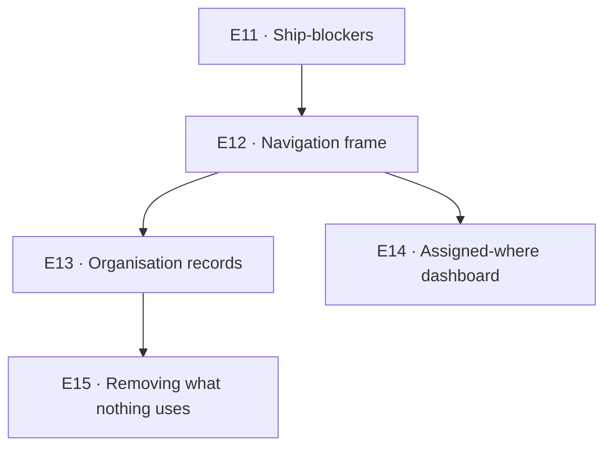

# Release 2 — Sprint Plan

**Owner:** Product · **Audience:** the delivery team · **Written:** 2026-08-24
**Companion documents:** [`../../SYSTEM_PLAN.md`](../../SYSTEM_PLAN.md) §7 (the grid the
menu is built on) · [`../06-decisions.md`](../06-decisions.md) ADR-9 to ADR-12 (why it is
built that way)

Story format, ID scheme and the sizing table are unchanged from
[`RELEASE_1_SPRINT_PLAN.md`](RELEASE_1_SPRINT_PLAN.md) §1. Read that once; it is not
repeated here. Epic numbering continues from E10, so nothing collides.

**A story is done when it is reachable.** A correct procedure with no caller is not
delivered. Release 1 learned this the expensive way and Release 2 starts with four
routers that prove it — `location.create`, `department.create`, `vehicle.create` and
`category.rename` all exist, all work, and none of them can be reached from the app.

---

## 1. What this release is

Release 1 answered *where is this tool*. Release 2 does three things and stops:

1. **Clears the ship-blockers.** The branch could not build a production image.
2. **Puts a frame around the product** so timesheets, purchase orders and project
   operations have somewhere obvious to land — without building any of them.
3. **Finishes small tools** — the dashboard, the two records Urban actually asked for, and
   the dead weight removed.

**Not in this release:** timesheets, purchase orders, invoices, heavy equipment, the
platform administrator, guests. Each has a place in the grid; none has code.

## 2. Epics

| Epic | Name | Est | Ships |
|---|---|---|---|
| **E11 · STI-1100s** | Ship-blockers | 21h | S1 — **16h done** |
| **E12 · STI-1200s** | The navigation frame | 60h | S1–S2 |
| **E13 · STI-1300s** | Organisation records | 29h | S2 |
| **E14 · STI-1400s** | Assigned-where dashboard | 28h | S2 |
| **E15 · STI-1500s** | Removing what nothing uses | 24h | S3 |
| **E16 · STI-1600s** | Security hardening | 26h | S1 (1601 — **done**) · S2 (1602–3) |

**Total 188 hours ≈ 24 developer-days**, of which 27 are complete.

**Done as of 2026-08-24:** STI-1101 (lockfile and the web image) and STI-1102 (the database
suites run in CI, with a guard so they cannot stop again quietly).

**Done as of 2026-08-27:** STI-1203 (pinned rows), plus the `NavItem.id` half of STI-1201 —
pulled forward because pins are keyed on it and there is no correct way to build one
without the other. The rest of STI-1201 (`children`, the third level, `recordType` /
`activity` / `description`) and all of STI-1202 are untouched.

Then STI-1601 (the CORS allow-list) and STI-1103 (delete what is empty). **S1 now has
STI-1104 and the rest of E12 left in it** — STI-1103's estimate turned out to be the wrong
shape rather than the wrong size; see the story.

## 3. Sequencing



E11 blocks everything because nothing can be deployed until it is done. E14 depends on E12
only for where its link lives, so it can be built in parallel and wired last.

---

## E11 · Ship-blockers — 21h

Nothing else in this document can be deployed until these are green.

### STI-1101 — Lockfile and the web image · S · 5h · **DONE 2026-08-24**

**Mechanism.** `@stinventory/mail` was added to `packages/api-contracts/package.json`
without regenerating `pnpm-lock.yaml`, and `docker/Dockerfile.web` never got the manifest
`COPY` line. Both fixed.

**Found on the way.** All three CI jobs and all three Dockerfiles use
`--frozen-lockfile`, so this was not a local-environment problem — CI and both production
images were failing. `apps/web` typecheck reported four `TS2307`s that read as a missing
module in `api-contracts` rather than a lockfile fault, which is why it looked unrelated.
`Dockerfile.web`'s own comment warns about exactly this and was not enough on its own,
because `mail` is a **transitive** dependency: nothing in `apps/web` imports it.

**AC.** `pnpm install --frozen-lockfile` succeeds ✓ · `pnpm typecheck` is 14/14 ✓ · both
production images build ✓ — `stinventory-web` 301MB and `stinventory-api` 1.33GB, verified
by real `docker build` runs rather than by reading the file.

### STI-1102 — Make the database suites run · M · 8h · **DONE 2026-08-24**

**Mechanism.** `pnpm test` reported success with **178 of 245 tests skipped**. Every
DB-backed suite opens with `describe.skipIf(!process.env.DATABASE_URL)` — correct on a
laptop, a hole in CI, where the `check` job ran with no Postgres service. Custody,
tenant-scoped login, ledger append-only, project scope and the RBAC matrix were all among
the skipped, which is the exact set the workflow header says nothing reaches main without.

Two changes. The `check` job gets the same Postgres service the `smoke` job already uses,
plus `DATABASE_URL` and a `Migrate` step before `Test`. And
`packages/api-contracts/src/db-suites-run.test.ts` fails the build when `CI` is set and
`DATABASE_URL` is not — a skip is invisible by construction, so something has to assert on
it.

**Found on the way.** The suites were never broken. Run in the api container they are
**245/245 passing, zero skipped**, and they were passing all along — nobody had run them
where they could see a database since the harness was written. A skipped suite prints as a
pass at a glance, which is why this survived a full release.

**AC.** CI runs the DB suites against a real database ✓ · a suite that silently stops
running fails the build ✓ · a developer with no stack up still gets a useful local pass ✓.

**Verified.** `make test` → 245 passed, 0 skipped. Guard test proven in all three states:
passes with no `CI`, fails with `CI=true` and no `DATABASE_URL`, passes with both.

### STI-1103 — Delete what is empty · XS · 3h · **DONE 2026-08-27**

**Mechanism.** `apps/web/app/(app)/rentals/` and `apps/web/app/(app)/foremen/` are empty
directories with no links. `packages/notifications/` contains only `node_modules` — no
manifest, no source, not in the lockfile or any workspace. Remove all three.

**AC.** Directories gone · `pnpm build` and `pnpm typecheck` unaffected · no grep hits for
the removed paths.

**Done, and it produced no diff — which is the finding.** All three were **untracked**.
Git does not store empty directories, so none of them was ever in a clone: `rentals/` and
`foremen/` were real routes deleted months ago (`git log` still has their `page.tsx`), and
what survived was the empty folder git leaves behind in a working tree it has already
stopped tracking. `packages/notifications/` has **no git history at all** — it is a bare
`node_modules/` that pnpm created and nothing else, never a workspace member, never in
`pnpm-lock.yaml`.

So this story cleaned up one machine, not the repository. A fresh clone never had the
problem, which also means nothing stops the empty folders reappearing in the next working
tree that deletes a route. Worth knowing before anyone writes the same ticket again:
`git status` cannot see this class of cruft, and neither can a reviewer.

Verified: no grep hits for the removed paths outside this plan and the 2026-08-24
changelog that first reported them, and `pnpm typecheck` unchanged across all 14 tasks.

### STI-1104 — Production deploy rehearsal · S · 5h

**Mechanism.** Build both images from a clean checkout, migrate a copy of the live database,
boot, and log in as three roles. `docs/DEPLOY.md` is the script; correct it where it is
wrong.

**AC.** A clean clone reaches a working login without a manual step that is not in
`DEPLOY.md`.

---

## E12 · The navigation frame — 60h

This is the release's real work. ADR-9, ADR-10 and ADR-11 are the specification; the
stories below are the build.

### STI-1201 — `NavItem` gains an identity and a third level · L · 16h · **PART DONE 2026-08-27**

**Mechanism.** `NavItem` is keyed by `href` today. Add `id` (stable, never derived from the
route), plus `recordType`, `activity` and a one-line plain-English `description`. Add
`children?: NavItem[]`, rendered by `app-sidebar.tsx` as a collapsible section.

**`id` is DONE.** Every item in both navs carries a unique, route-independent `id`, and the
type documents it as the one field that may not change. It shipped with STI-1203 rather
than here because a pin has to store an id and building pins on hrefs would have had to be
undone. `recordType`, `activity`, `description` and `children` are **not** done — the shell
is still two levels, and `matchItem` still resolves two.

The metadata is not decoration. Release 2's generative Desk reads the navigation config as
its map of the product — the same reason `PERMISSION_LABELS` exists in `packages/types`.

**AC.** Every item has a unique `id` · a route rename changes no `id` · a group with
`children` renders collapsed-by-default except on the active path · `matchItem` resolves the
longest match through three levels, not two · permission filtering still happens **once**,
in `app-shell.tsx`, into the array both the rail and the sidebar read.

**Cases.** A third-level row whose parent the actor cannot see must not render. A parent
whose children are all filtered away must drop out entirely, like an empty group does today.
Expansion state persists per group, not globally.

**Guard.** A third-level row must be a **preset of its parent's record type** (ADR-10).
Children of different record types are second-level siblings. Enforce it in review; there is
no way to type it.

### STI-1202 — Retree the navigation · M · 8h

**Mechanism.** Config change only. No route moves, no screen changes.

```
Overview        Dashboard · My Desk
Operations    ▾ Small Tools    By Jobsite · Tool Registry · Custody · Map
              ▾ Equipment      (empty until heavy equipment lands)
              ▾ Purchasing     (empty until purchase orders land)
Organization    People · Projects / Jobs · Teams · Departments · Job Groups
Insight         Reports & Logs · Activity
── foot ──
Settings        General · AI · Appearance · Users · Roles · Modules
```

`/old-dash` goes. Its own comment says it was "kept until the monitor has been lived with",
and it has been.

**Deliberately absent.** No Reference Data section, and no rows for locations, vehicles,
categories or models — see STI-1303 and E15 for why each one is not a register.

**AC.** Every existing route is reachable · no route string changes · empty placeholder
groups do not render.

### STI-1203 — Pinned rows · M · 8h · **DONE 2026-08-27**

**Mechanism.** A click on a star pins a row. Pins are a `Set<id>` in `localStorage`
under `sti-pins`, rendered as a Pinned section at the head of the sidebar.

**Two rules that are the whole story.** Pin the **`id`**, never the href, or a route rename
strands every pin silently. And render pins by **intersecting with the already-filtered
groups**, never from `localStorage` directly — otherwise revoking a permission leaves a
working link in somebody's sidebar. This is the same class as the job-scope rule in
`.claude/rules/web.md`: a client-side list is never access control.

**AC.** Pinning survives reload · an unknown id in storage is ignored, not rendered · a
pinned row whose permission is revoked disappears · pinning is available to every role and
needs no permission.

**Cases.** Storage disabled or full must not break the sidebar. A pinned row that is also in
the active group renders in both places — that is correct, not a bug.

**Later, not now.** `user_preferences.dashboard` already exists as a jsonb column if pins
should follow a user between devices. Per-browser was the explicit ask.

**Built.** `apps/web/components/sti/nav-pins.ts` — `read`/`write` both swallow storage
failures, and `pinnedItems(groups, pins)` is the pure intersection, called once from
`app-sidebar.tsx` against the array the shell has already permission-filtered.
`useNavPins` starts empty and fills in an effect, because reading storage during render
would not match the server HTML.

**Verified.** `e2e/tests/nav-pins.spec.ts`: a pin survives a reload; unpinning removes the
section; an id naming nothing renders nothing; and an HR account whose seeded `sti-pins`
names `tool-register`, `custody` and `people` gets exactly one row, `/people`. The last is
the one that matters — it is what stops a hand-edited `localStorage` key becoming a link.
The rest of the browser suite is unchanged and still green.

### STI-1204 — Module visibility · L · 16h

**Mechanism.** `tenant_settings.disabled_modules jsonb` — a list of navigation item **ids**.
Filtered in `app-shell.tsx`, in the same pass as the permission filter. A new
`/settings/modules` screen behind `config.manage` lists every module with a toggle. Disabled
routes redirect to `/home`.

**ADR-11 is the specification and its constraint is load-bearing:** this is configuration,
not authorisation. Every permission check behind a hidden module stays exactly where it is.
Hiding removes the door, not the lock.

**AC.** Disabling a module hides it from the rail and the sidebar together · a direct URL
redirects · **the API still enforces every permission behind it, proven by a test that calls
a disabled module's procedure and gets its normal answer** · Settings cannot be disabled,
enforced in code and covered by a test.

**Cases.** Disabling every module in a group drops the group. An id in `disabled_modules`
that no longer exists is ignored. Two administrators toggling at once is last-write-wins,
which is fine — say so rather than building locking.

**Seed.** Seed a tenant with at least one module disabled. A setting no seeded data exercises
is a setting nobody tests.

### STI-1205 — Turn off Hand Off and the HR surfaces · S · 5h

**Mechanism.** Ship `/chat` and the HR surfaces in `disabled_modules` by default. Leave the
`hr` role defined and unassigned. **No code is deleted and nothing is wired more deeply into
the new frame** — Urban wants both re-planned properly later, and the intent-parser work
behind Hand Off is real.

**AC.** Neither appears for any role in a fresh tenant · both come back by un-ticking one
box · `packages/intent` and the messaging worker are untouched.

### STI-1206 — Rename the administrator roles in the interface · XS · 3h

**Mechanism.** `owner` → "Organisation Administrator", `office_admin` → "Business
Administrator". Labels only — no permission changes, no migration, no role-name branching
introduced. SYSTEM_PLAN §2 has warned since the beginning that "admin" means three things
here; this is the cheap half of fixing it.

**AC.** Role names in `/admin/roles`, the user form and the account menu read the new
labels · `ROLES` is unchanged · the RBAC matrix test still passes untouched.

### STI-1207 — Update `.claude/rules/web.md` · XS · 3h

**Mechanism.** The rules file describes a two-level shell and two hard-coded nav arrays.
After E12 it describes neither. Rewrite the navigation section: three levels, ids, pins,
module visibility, and the preset rule.

**Why it is a story and not a chore.** `.claude/rules/` is what every agent is told to read
before touching an area. A wrong rule there misleads every future change. This has already
cost this project a ticket written against a deleted feature.

---

## E13 · Organisation records — 29h

Urban's answer on which of these are real, 2026-08-24: **departments and teams yes;
locations and categories are tags, not registers; vehicles are equipment.**

### STI-1301 — Departments screen · M · 8h

**Mechanism.** `department.list/create/update` exist and only `list` has a caller. A
department is a **cost target** — `COST_TARGETS = ["project", "department"]` — so it is the
thing a mechanic's custody charges when no project does. Build the table under Organization.

**AC.** Create, rename and list, all `tenantId`-scoped · gated on `department.manage` ·
deleting is out of scope until the cost-target consequences are specified.

### STI-1302 — Teams screen · M · 8h

**Mechanism.** `projectTeam.assign/remove/all` already work, but only from inside
`/jobsites`. Surface the cross-project view: who is on what, and the gaps. Reuse
`jobsite-team-strip.tsx`; do not write a second writer.

**AC.** One screen shows every project's team · assign and remove go through the existing
procedures · the assignment hierarchy is still enforced server-side, unchanged.

**Cases.** Assigning a foreman **moves their tools**. That is existing behaviour and the
screen must say so before it happens, exactly as the jobsite page does.

### STI-1303 — Category is a tag, not a register · S · 5h

**Mechanism.** Urban's call: a category is somewhere to tag a tool, null is fine, and it
should not be redundant. The schema already agrees — the asset carries a denormalised
`category_name`, `category.create` dedupes case-insensitively, and `adoptInUse` backfills
the table from names in use. Finish it as a tag: a dedupe typeahead on the tool form that
creates on miss. **No nav row, no register screen.**

**AC.** Typing an existing name in any case reuses it rather than creating a second · blank
is accepted and stored as null · the register idea is written off in the doc, not left
half-built for someone to finish.

### STI-1304 — Locations stay derived · XS · 3h

**Mechanism.** No build. Record the decision where the next person will look: a tool with no
project is in the pool, the Pool tab already shows it, and there is no yard entity. Urban
does not use "gang box". Correct `docs/09-vocabulary.md` — done 2026-08-24 — and leave
`location` alone: its `custodianEmployeeId` and `moveContents` machinery runs trailers and is
not up for removal.

**AC.** No screen says "yard" as though it were a place, or "gang box" at all.

### STI-1305 — Seed the new states · S · 5h

**Mechanism.** Seed a department that owns tools, a project with an incomplete team, and a
tool with a null category. Every state a rule can reach needs seeded data, including the
edge that trips the rule.

---

## E14 · Assigned-where dashboard — 28h

### STI-1401 — What is assigned where · XL · 20h

**Mechanism.** The question Urban actually asks: for every project, what is on it and who
holds it — plus the pool, for everything on nothing. It is `Small Tools × Deploy` aggregated
to the company, where `/jobsites` is the same question for one job.

Scope comes from `packages/api-contracts/src/scope.ts` and is applied **to the query, never
as a post-filter**. This is non-negotiable and is how the dashboard totals leaked once
already.

**AC.** Every project with a count, plus a pool row · drill through to the jobsite · a
foreman sees their crew's tools and not the company's · totals reconcile with the register
under the same scope.

**Cases.** A project with no tools still renders, at zero. A tool held by somebody with no
project counts once, in the pool, and never twice.

### STI-1402 — Retire `/old-dash` · S · 5h

**Status: DONE on 2026-09-03**, out of band as part of the design-consistency
pass (the `/desk` command surface went with it at the user's direction).

**Mechanism (as planned).** Delete the route and `dashboard-widgets.tsx` if
nothing else reads it. Check `widgetVisibility(prefs)` first: STI-501
criterion 6 kept preferences deciding layout while permissions decide
existence, and that separation must survive.

**What actually happened.** `/old-dash` and `/desk` routes, `components/desk/`,
`components/sti/dashboard/`, `greeting-bar.tsx` and `movement-chart.tsx` were
deleted. `dashboard-widgets.tsx` SURVIVED — the capital-split, fleet-status
and movement-rate widgets still feed `/reports/charts/*` and
`/reports/audit-trail` — but lost the old-dash-only exports (`InboxStatusWidget`,
`WIDGET_DEFS`, `widgetVisibility`). The orphaned `dashboard.briefing` procedure
was deleted (its only caller was the Blocky tab). The seed's `old-dashboard`
hidden feature row went with the module, and the two nav-feature-flags browser
tests that asserted on it were removed.

### STI-1403 — Dashboard is per domain, not global · XS · 3h

**Mechanism.** Documentation only. Record that when Labour and Equipment arrive, each gets
its own roll-up and Overview composes them. Stops the next person bolting timesheet tiles
onto the tools dashboard.

---

## E15 · Removing what nothing uses — 24h

Every item here is dead weight that a future agent will otherwise "helpfully" wire up.

### STI-1501 — Drop the vestigial catalog tables · L · 16h

**Mechanism.** `asset.ts:28` says it plainly: nothing reads or writes `asset_model`,
`manufacturer` or `asset.modelId` — only the seed populates them and no router, intent or UI
joins back. They duplicate the flat `make` / `model_number` columns. Drop all three plus the
dead FK.

**AC.** Migration generated with `make generate`, committed, and run with `make migrate` ·
`meta/_journal.json` has the new entry — check it after any merge · seed no longer populates
them · `pnpm typecheck` and the DB suites pass.

**Cases.** This is a destructive migration against a live database. It needs the E11
rehearsal first, and a verified backup. If the round-trip import in
`docs/built/13-excel-round-trip.md` reads any of these columns, this story stops and gets
re-specified.

### STI-1502 — Trim `LOCATION_TYPES` · S · 5h

**Mechanism.** Five types, three with zero rows anywhere: `gang_box`, `site_container`,
`project_site`. Remove them from the enum. `warehouse` and `vehicle` stay — both are used.

**AC.** No seed, router or screen references a removed type · a row in the database with a
removed type is impossible, confirmed by query before the change.

### STI-1504 — One page saying where the next thing goes · XS · 3h

**Mechanism.** A short section in `AGENTS.md` pointing at the grid in SYSTEM_PLAN §7 and
ADR-9/10/11, so the answer to "where does the timesheet module go" is the same whoever is
asked.

---

---

## E16 · Security hardening — 26h

Found in the pre-production review, 2026-08-24. None of these is an active breach; two are
one-line fixes and the rest are latent. The stack is Next.js → Hono/Node → Postgres, and the
things that matter most about it are already right: Zod at every router edge, Drizzle
parameterising every query, bcrypt with a rehash-on-login path, per-tenant AES-256-GCM for
the LLM and SMTP secrets, and a tenant predicate on every write with a source-scanning test
to keep it that way.

### STI-1601 — CORS reflects any origin · XS · 3h · **DONE 2026-08-27**

**Mechanism.** `apps/api/src/index.ts:56` is
`origin: (origin) => origin ?? env.WEB_ORIGIN` with `credentials: true`. That echoes the
caller's own `Origin` header back as `Access-Control-Allow-Origin` — every origin is
allowed.

**Correction, made while fixing it (2026-08-27).** This paragraph used to end "and the
`WEB_ORIGIN` fallback only applies when no `Origin` was sent at all". That was wrong: the
fallback never ran. hono passes the callback `c.req.header("origin") || ""`, so a missing
header arrives as an empty string and `??` does not catch `""` — the callback returned
`""` and hono omitted the header. `env.WEB_ORIGIN` was dead in that expression. Measured
against the old config before it was replaced, not read off the source.

**Why it is not currently an account-takeover.** The session is a bearer token in
`localStorage`, not a cookie, so a browser will not attach it to a cross-origin request. The
attacker's page can call the API but has nothing to call it with.

**Why it still has to be fixed.** `credentials: true` beside a reflected origin is the exact
configuration that turns into full account takeover the moment anybody adds a cookie — and
`credentials: true` says somebody already intended to. Pin the origin to `WEB_ORIGIN`.

**AC.** A request from an unlisted origin gets no `Access-Control-Allow-Origin` · the web app
still works · a test covers both.

**Built.** `apps/api/src/cors.ts` — `allowedOrigins(env)` and `corsOptions(env)`, mounted by
`index.ts` in one line. A separate module because `index.ts` opens a database connection and
calls `serve()` at import, so a test cannot load it; the options had to be reachable on their
own for the AC's test to exist at all.

**It allows `MOBILE_ORIGIN` as well as `WEB_ORIGIN`, which the story did not say to do.**
`MOBILE_ORIGIN` has sat in `packages/env`, `.env.example` and `docker-compose.prod.yml` since
the mobile client existed with **no reader anywhere**; this is its first. Pinning to
`WEB_ORIGIN` alone as written would have blocked Expo *web*, which is served from :8081 and
is a real cross-origin caller. The Expo native build sends no `Origin` header and is
unaffected either way. Production already defaults `MOBILE_ORIGIN` to empty, and empty is
filtered out rather than passed through — `[""].includes("")` is true, so leaving it in the
list would have matched every request that sends no `Origin` at all.

An **array** rather than a function, deliberately: hono resolves an array as
`list.includes(origin) ? origin : null`, and `null` omits the header entirely, which is
exactly what the AC asks for.

**Verified** against the running stack, not deduced: the web origin and the mobile origin are
echoed back; `https://evil.example.com` gets `Access-Control-Allow-Credentials` and **no**
`Access-Control-Allow-Origin`, on both a plain GET and a preflight; a request with no `Origin`
gets none either. A real `POST /auth/login` from `http://localhost:3100` returns 200 with the
header. `apps/api/src/cors.test.ts` (7 cases) mounts the real `corsOptions` on a throwaway
Hono app — no database, so unlike `request-worker.test.ts` it always runs — and each case was
checked against the OLD config first to confirm it fails there. The full browser suite (27,
five roles) passes unchanged, which is the "web app still works" half of the AC.

**Note for STI-1602.** CORS does not stop the request; it stops the attacker's page from
*reading the answer*. That login from `evil.example.com` still returns 200 server-side. It is
harmless only because the attacker has no credentials to send — the moment the session is a
cookie the browser attaches automatically, this allow-list is the whole defence.

### STI-1602 — The session token lives in `localStorage` · L · 16h

**Mechanism.** `apps/web/lib/auth.ts` keeps the session in `localStorage["sti-session"]`,
which any successful XSS can read and exfiltrate. There is **no Content-Security-Policy**
anywhere — not in the Caddyfile, not in `next.config.mjs` — so nothing narrows the blast
radius.

Two independent improvements, either worth having: move the session to an `HttpOnly`,
`Secure`, `SameSite=Lax` cookie (which then makes STI-1601 mandatory, not optional), and add
a CSP.

**Cases.** Cookies change the mobile client's auth path too. Scope that before starting, or
split the story.

### STI-1603 — Update the dependencies with prod-reachable advisories · M · 8h

**Mechanism.** `pnpm audit --prod` reports 26, of which 13 are high. The reachable ones:

| Package | Advisory | Note |
|---|---|---|
| `drizzle-orm` 0.36.4 | SQL injection via improperly escaped identifiers, fixed 0.45.2 | **No reachable path found.** The only dynamic-identifier surface is `table-helpers.ts`, and sort keys are whitelisted through a `SortableMap` — an unknown key returns `undefined`. Upgrade anyway; nine minors behind a fix is not a position to defend |
| `nodemailer` | DoS in `addressparser` | Reachable — this is the invite mailer |
| `xlsx` | ReDoS | Reachable through `import-dialog.tsx` |
| `image-size`, `js-yaml`, `nanoid`, `brace-expansion` | DoS | Transitive |

The single **critical** is `vitest`'s UI server — a dev dependency that is never shipped.
Not urgent, and say so rather than letting the word "critical" drive the queue.

**AC.** `drizzle-orm`, `nodemailer` and `xlsx` on patched versions · `pnpm test` still
245/245 in the container · the remaining advisories listed with a reason for each.

---

## 4. Sprints

| Sprint | Contents | Hours |
|---|---|---|
| **S1** | E11 in full · STI-1601 · STI-1201, STI-1202 | 48h — 19h done |
| **S2** | STI-1203 to STI-1207 · E13 · E14 · STI-1602, STI-1603 | 117h |
| **S3** | E15 | 24h |

S1 is the deployable one: after it, the product builds, the tests are honest, and the frame
is in place. Everything after S1 is additive.

## 5. Risks

| Risk | Mitigation |
|---|---|
| STI-1501 is destructive against live data | Rehearse in E11, verified backup, stop if the Excel round-trip reads those columns |
| Module visibility gets mistaken for a permission | ADR-11, plus the STI-1204 test that calls a disabled module's procedure and expects its normal answer |
| The third nav level becomes a dumping ground | The preset rule in ADR-10, enforced in review |
| `.claude/rules/web.md` goes stale against the new shell | STI-1207 is a story in the same epic, not follow-up work |
| Pins outlive the permission that justified them | STI-1203 renders from the filtered array, never from storage |

## 6. Definition of done

Release 1's §16 applies unchanged. Two additions:

- **Reachable.** A procedure with no caller is not delivered. Four routers in this codebase
  prove the point.
- **Seeded.** If the story adds a threshold, a status, a role or a state, the seed reaches
  it — including the edge that trips the rule.
