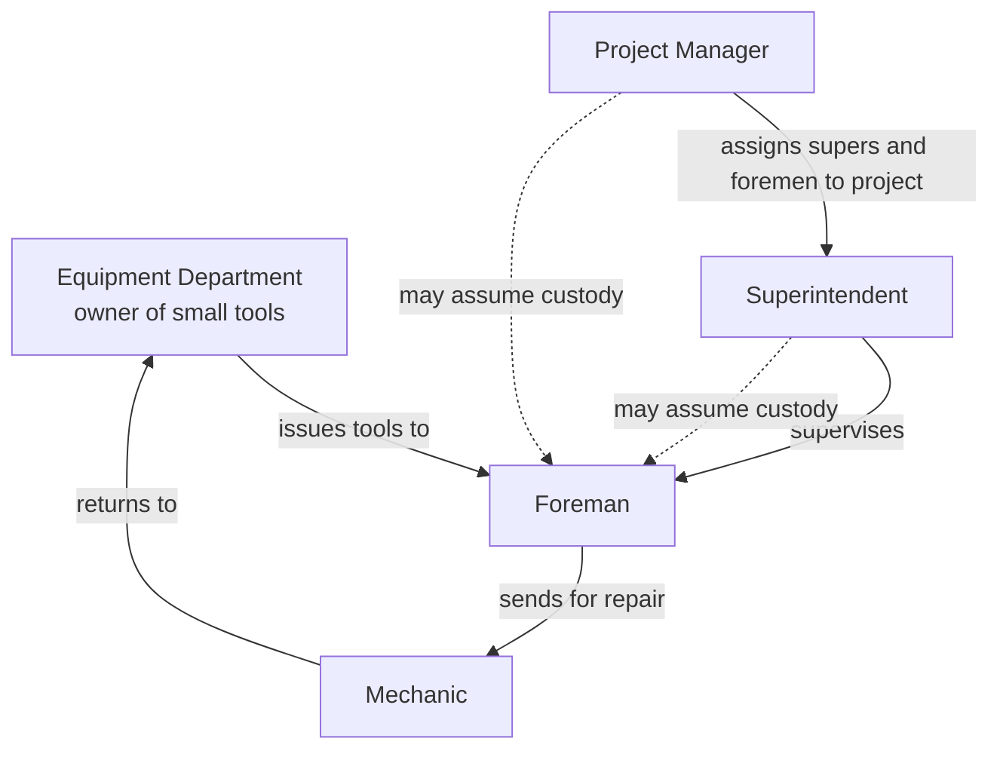
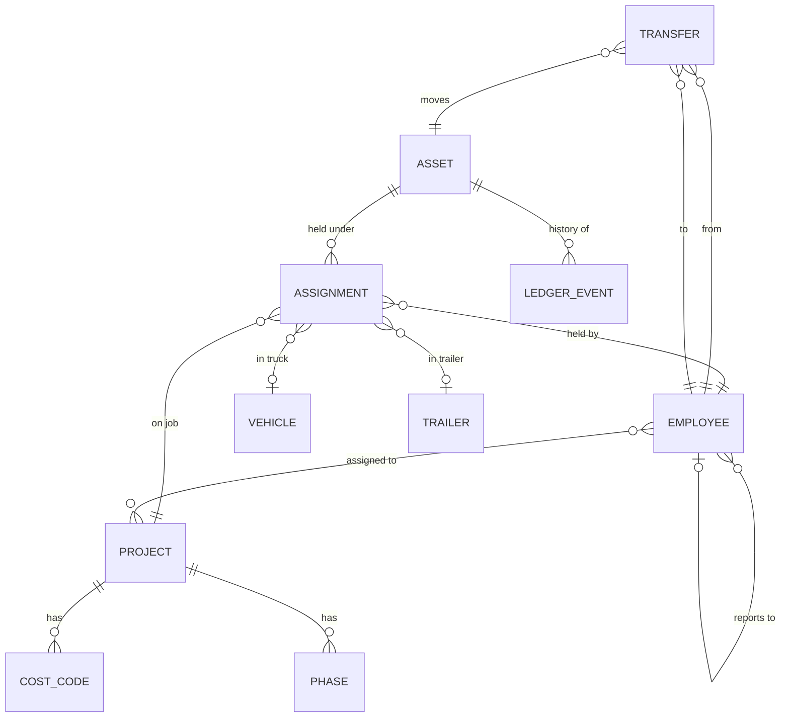
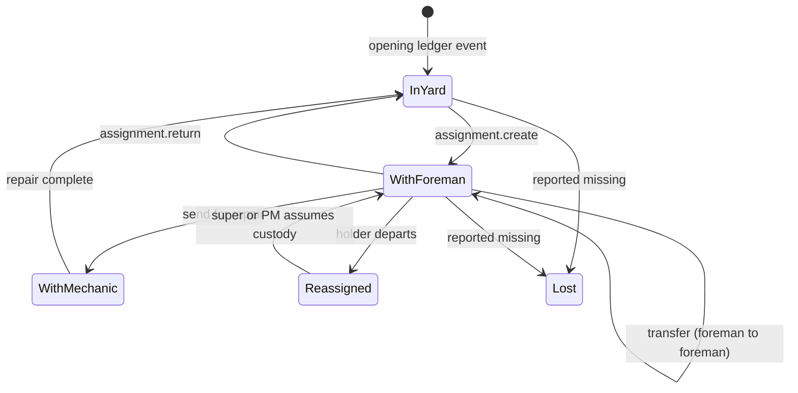
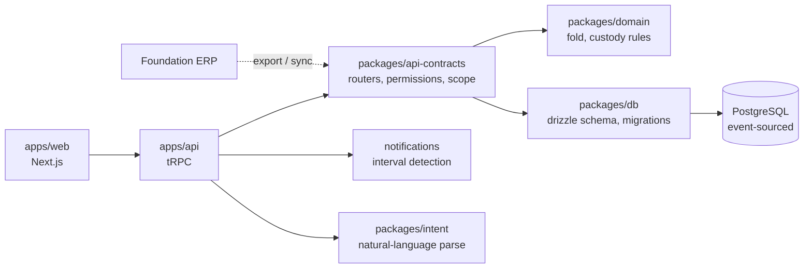
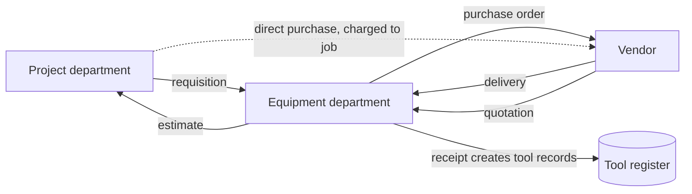

# STInventory — System Plan

**Owner:** Bodhi Labs Pvt. Ltd. for Urban Infraconstruction
**Status:** Release 1 in delivery, target 24 August 2026
**Purpose of this document:** the single reference for what the system is, what exists, what is being built, and what comes next. Written to be read by both people and language models. When an AI assistant is asked to work on this codebase, this file is the intended starting context.

> **Reading rule for AI assistants.** Statements under *Current state* are grounded in a file-level assessment dated 2026-08-09. Statements under *Roadmap* are intent, not fact. Pseudo-code is illustrative of intended shape, not literal source. Verify against the repository before acting on anything here.

---

## 1. What the system is for

Urban Infraconstruction is a US construction contractor. Small tools — hand tools and power tools, explicitly **not heavy equipment** — are bought either against a project budget or by the Equipment department, then issued to foremen. A foreman loads them into a company trailer, tows the trailer with a company or personal truck, and drives to a jobsite. Tools move between foremen, go to mechanics for repair, and return to the yard.

The spreadsheet that tracks this cannot answer the questions that matter: *where is this tool, who has it, which job is it on, which trailer is it in, and who is accountable if it disappears.*

The system is a **web-based system of record for tool custody**, with an append-only history so that every answer is provable rather than asserted.

### Non-goals for Release 1

- No mobile application. All actions are performed at a desk on the web app.
- No QR or barcode scanning, no photograph or signature capture at handover.
- No offline operation.
- No heavy equipment, consumables, or preventive maintenance.
- No procurement.

---

## 2. Who uses it

Two organisational groups plus the engineering team.

| Group | Roles | Relationship to tools |
|---|---|---|
| **Equipment department** | Department head, Equipment Administrator | **Owns** the small tools programme. Super-users. Buys tools, issues them, runs the desk queue, resolves disputes. |
| **Project / operations** | Project Manager, Superintendent, Foreman, Engineer | Consumes tools. PM owns the project; superintendents run crews; foremen hold tools. |
| **Engineering** | System Administrator (Bodhi Labs) | Platform administration, schema, releases. Distinct from Office Administrator, who is an Urban business-side admin. |
| **Support** | Mechanic | Holds tools while repairing them. |
| **Office** | Office Administrator | Business administration; not a system administrator. |

> **Terminology trap.** "Admin" is ambiguous in Urban's usage and must never be a single role in code. It resolves to at least three distinct things: *System Administrator* (Bodhi Labs engineering), *Equipment Administrator* (owns tools), *Office Administrator* (business admin). Permissions must be checked, never role names — see §6.3.

### Organisational hierarchy



The dotted lines are the **departure path**: when a foreman leaves or is dismissed, their tools, trailers and *company* trucks are reassigned in one action to their superintendent, or to the Project Manager where necessary. Personal vehicles are never reassigned — they are not Urban property and leave with the person.

---

## 3. Domain model



### Core invariants

These are the rules the system exists to guarantee. Each must be enforced at the **database** level, not only in application code.

1. **One active assignment per asset.** A tool is held by exactly one party at any instant. Enforced by a partial unique index, not by application logic.
2. **The ledger is append-only.** No `UPDATE`, no `DELETE`, ever. Enforced by grant restriction or trigger, not by comment.
3. **Custody writes are atomic.** The projection update, the custody move and the ledger insert succeed together or not at all — one transaction.
4. **The projection is derivable.** Folding the ledger from the beginning must reproduce the current register exactly. A scheduled check proves it.
5. **Every assignment carries full context.** Job, truck and trailer — all three, independently nullable but independently recordable.

> Invariant 5 currently fails: assignment holds a single `locationId`, which cannot represent a truck *and* a trailer simultaneously. This is Release 1 Phase 2.

### Custody state machine



**Desk-origin model, not verification model.** Urban operates a desk, and the desk is the only writer of movements: foremen hold neither `assignment.create` nor `transfer.create` (removed 2026-08-09 — see the rationale in `packages/domain/src/rules.ts`). Every hand-off is recorded at the desk as `pending_approval` and approved or declined there; nothing moves first to be verified later, because nobody but the desk can record a move. The receiving foreman is still never asked to accept — do not implement recipient accept/reject. The old `pending_verification` transfer state is historical only: no writer can produce it, and its enum entry survives solely so old rows render.

---

## 4. Architecture



**Event-sourced core.** The ledger is the truth; `current_*` tables are a projection for query performance. Any disagreement between them is a bug, and invariant 4 is how it gets caught.

**Monorepo, pnpm.** Packages: `db`, `domain`, `api-contracts`, `auth`, `types`, `env`, `intent`. Apps: `web`, `api`.

---

## 5. Current state

Assessed 2026-08-09. **63.6% complete** by size-point arithmetic (121 of 190 points). The number excludes the conversational layer, which is substantial working code — see §8.1.

| Area | Status | Note |
|---|---|---|
| Foundation | `FUNCTIONAL` | Event-sourced schema, 12 migrations, CI with build/migrate/smoke/deploy/rollback |
| Access control | `PARTIAL` | 5 of 7+ roles can log in. **No user administration exists at all.** |
| Master data | `PARTIAL` | Tools, categories, projects, employees, locations, trucks, trailers all CRUD. Vendors read-only. |
| Custody engine | `PARTIAL` | Best-designed area. **Approve/verify/decline procedures have no caller in any screen.** |
| Spreadsheet import | `FUNCTIONAL` | Genuinely good: typed validation, dedup, preview, transactional commit. No tests. |
| KPI dashboard | `FUNCTIONAL` | 10+ reports, filters, export. Ignores project scoping. |
| Notifications | `PARTIAL` | Delivery is a `console.log` that then marks rows delivered. |
| Production readiness | `PARTIAL` | No error boundaries, no integration tests, lint non-blocking. |

### The five things that matter most

1. **The desk queue is unreachable.** Correct backend procedures, no UI calling them, and the transfer form directs users to an Inbox that cannot handle transfers. Backend logic that cannot be run is not delivered.
2. **Custody writes are not atomic.** Three consecutive unwrapped statements. Import does this correctly; custody does not.
3. **One-active-assignment has no DB constraint,** and duplicates already exist in live data.
4. **The ledger is append-only by comment only.** Nothing prevents an `UPDATE`.
5. **Two migrations are uncommitted.** Production may not match `main`. Fix today; it is free.

---

## 6. Release 1 — by 24 August 2026

48 units, 5 phases, USD 2,500. One unit ≈ half a developer-day.

### 6.1 Phase 1 — Custody trail (13 units)

Make the history trustworthy before anything is built on top of it.

```
# Atomic custody write — the shape every custody mutation must take
def apply_custody_change(actor, asset, action, context):
    require_permission(actor, action)

    with db.transaction() as tx:                    # invariant 3
        current = tx.lock_for_update(active_assignment(asset))
        validate_transition(current.state, action)  # domain rules, pure

        tx.close_assignment(current)
        new = tx.open_assignment(
            asset      = asset,
            holder     = context.holder,
            project    = context.project,
            truck      = context.truck,             # invariant 5
            trailer    = context.trailer,
        )
        tx.append_ledger(                           # invariant 2, append-only
            asset     = asset,
            action    = action,
            actor     = actor,
            snapshot  = new.to_snapshot(),
            occurred  = now(),
        )
        tx.update_projection(asset, new)
    notify_desk_if_pending(new)
    return new
```

```sql
-- Invariant 1, at the database
CREATE UNIQUE INDEX assignment_one_active_uq
  ON assignment (asset_id)
  WHERE status = 'active';

-- Invariant 2, at the database
REVOKE UPDATE, DELETE ON ledger_event FROM app_role;
```

```
# Invariant 4 — scheduled reconciliation
def verify_projection():
    divergent = []
    for asset in all_assets():
        folded = fold(ledger_events_for(asset))     # pure, packages/domain
        if folded != projection_for(asset):
            divergent.append((asset, folded, projection_for(asset)))
    report(divergent)                                # must be empty
```

Tasks: desk queue screen (approve / decline) · atomic writes · unique index + duplicate backfill · ledger immutability · reconciliation check · desk alert on pending · commit migrations + drift detection in CI.

**Risk.** The duplicate backfill must decide which of two active assignments survives. That is a per-tool judgement made with the Equipment department, not a script.

### 6.2 Phase 2 — Assignment detail (7 units)

Truck and trailer as first-class fields. Company and personal trucks distinguished, because the distinction drives the departure path in Phase 3.

```
Assignment {
  asset_id, holder_id, project_id,
  truck_id?    -> vehicle(ownership: 'company' | 'personal')
  trailer_id?  -> trailer(always company)
  status, opened_at, closed_at
}
```

Migrating from single `locationId` touches every reader and every ledger snapshot shape. Snapshots are historical and must not be rewritten — the fold must handle both old and new shapes.

Plus error boundaries and typed `TRPCError` across routers.

### 6.3 Phase 3 — Roles, accounts and organisation structure (18 units)

Largest phase. Blocked on Urban agreeing the permission matrix by working day 2.

```
# Permissions are checked. Role names are never branched on.
def visible_assets(actor):
    if has_permission(actor, 'assets.view.all'):        # equipment dept, sysadmin
        return all_assets(tenant=actor.tenant)
    if has_permission(actor, 'assets.view.project'):    # PM
        return assets_on_projects(projects_of(actor))
    if has_permission(actor, 'assets.view.crew'):       # superintendent
        return assets_held_by(foremen_reporting_to(actor))
    if has_permission(actor, 'assets.view.own'):        # foreman
        return assets_held_by(actor)
    return []
```

```
# Departure — reassign everything a leaver holds, in one auditable action
def reassign_on_departure(actor, leaver, successor=None):
    require_permission(actor, 'custody.reassign')

    successor = successor or superintendent_of(leaver) or project_manager_of(leaver)
    assert successor, "no successor in the reporting chain; choose explicitly"

    with db.transaction() as tx:
        for item in held_by(leaver):                  # tools, trailers, trucks
            if item.kind == 'vehicle' and item.ownership == 'personal':
                continue                              # never Urban property
            apply_custody_change(actor, item, 'reassign_on_departure',
                                 context(holder=successor, reason='departure'))
        tx.deactivate_user(leaver)
```

Tasks: permission matrix defined with Urban · missing login roles (System Administrator, Office Administrator, Equipment Administrator, Engineer, Mechanic) · user administration (create, assign role, deactivate, reset password) · organisation structure assignment (PM assigns supers and foremen to projects; foremen to supers) · departure reassignment · tenant-scoped login · permission-based scoping replacing role-name checks · RBAC matrix test across all roles.

**Open question that blocks this phase:** nobody has yet defined what an Engineer may do. It appears in the requirements and nowhere in the codebase.

### 6.4 Phase 4 — Foundation entity load (6 units)

One-time load of **users, jobs, cost codes and phases** from a Foundation export. The mechanism must be built so that later loads, hand-entered records and future automated sync all use the same identity rules.

```
# Idempotent upsert keyed on the source system's own identifier.
# Re-running a load updates; it never duplicates.
def load_from_foundation(export, actor):
    report = {'created': [], 'updated': [], 'unmatched': []}

    for row in export.rows:
        key = ExternalRef(system='foundation', type=row.type, id=row.native_id)

        existing = find_by_external_ref(key)
        if existing:
            changed = diff(existing, row)
            if changed:
                update(existing, row, source='foundation')
                append_ledger(existing, 'synced', actor, changed)
                report['updated'].append(key)
            continue

        candidate = fuzzy_match(row)        # name + job number, for pre-existing rows
        if candidate and not candidate.external_ref:
            attach_external_ref(candidate, key)      # adopt, do not duplicate
            report['updated'].append(key)
        elif candidate:
            report['unmatched'].append((row, 'conflicts with different external ref'))
        else:
            created = create(row, external_ref=key, source='foundation')
            append_ledger(created, 'imported', actor, row)
            report['created'].append(key)

    return report                            # unmatched rows are surfaced, never dropped
```

**Redundancy strategy — the three entry paths must converge.**

| Path | Identity rule |
|---|---|
| Synced from Foundation | `external_ref(foundation, type, native_id)` — authoritative |
| Imported from spreadsheet | matched on natural key, then given an `external_ref` if one is found later |
| Added by hand | no `external_ref` until a sync adopts it; adoption is by natural-key match |

Every entity therefore carries: `external_ref` (nullable, unique per system+type), `source` (`foundation` \| `import` \| `manual`), and `last_synced_at`. Fields owned by Foundation are read-only in the UI once an `external_ref` exists, so a local edit cannot silently diverge and then be overwritten.

### 6.5 Phase 5 — Desk views by role (4 units)

The Desk is the intended long-term surface for the entire system. Release 1 establishes it for small tools only.

```
# The Desk is composed, not hard-coded per role.
def build_desk(actor):
    panels = []
    for panel in PANEL_REGISTRY:                  # declarative, extensible
        if has_permission(actor, panel.permission):
            panels.append(panel.render(scope=visible_scope(actor)))
    return Desk(panels=panels, scope=visible_scope(actor))

PANEL_REGISTRY = [
    Panel('tools.by_jobsite',  'assets.view.project', ToolsByJobsite),
    Panel('tools.mine',        'assets.view.own',     MyTools),
    Panel('crew.tools',        'assets.view.crew',    CrewTools),
    Panel('desk.queue',        'custody.verify',      PendingQueue),
    Panel('tools.overdue',     'assets.view.all',     OverdueTools),
]
```

Registry-driven so Release 2 adds panels without touching role logic. Tools-by-jobsite shows holder, truck and trailer against each tool.

---

## 7. Roadmap

### Release 2 — next engagement

**The Desk question-and-answer interface.** A user describes the view they want in their own words; the Desk assembles it from the panel registry. `packages/intent` already parses natural language, and messaging, tasks and inbox already exist — this is an extension of built work, not a new capability.

```
# Generative view assembly — Vercel AI SDK generative UI pattern
async def answer_on_desk(actor, question):
    intent = await parse_intent(question, schema=DESK_INTENT_SCHEMA)
    # intent := { entity, filters, group_by, time_range }

    allowed = visible_scope(actor)                # authorisation BEFORE data access
    if not intent_within_scope(intent, allowed):
        return refuse(actor, intent)              # never leak out-of-scope existence

    data  = execute_scoped_query(intent, allowed)
    panel = select_panel(intent)                  # from PANEL_REGISTRY
    return stream_ui(panel, data)
```

> **Security rule, non-negotiable.** The model chooses *presentation*; it never chooses *scope*. Authorisation is applied to the query before execution, never as a post-filter on results, and never delegated to the model.

**Ongoing Foundation synchronisation.** Scheduled, idempotent, reusing the Phase 4 identity rules. Cannot be sized until the Foundation interface is known — a nightly CSV drop is days; a live API with conflict resolution is weeks.

Also: email and SMS delivery with overdue escalation · vendor management · import history and undo (as compensating events, never deletes) · additional reports and server-side export · integration and end-to-end tests · Redis rate limiting · backup and restore runbook.

### Later releases

**Procurement.** Not near-term, but the intended shape:



Requisition → approval → estimate → quotation → purchase order → receipt → tool records created automatically with the purchase source (project-funded or Equipment-funded) recorded. Order tracking throughout.

**Also later:** foreman mobile application · heavy equipment · consumables and depletion · preventive maintenance and calibration · job cost allocation and chargeback rates.

**Research capability.** A GPU workstation (NVIDIA DGX Spark / ASUS Ascent class) provided by Urban and held by Bodhi Labs, for training and AI research on system functions. Urban's property; Bodhi Labs may use spare capacity for its own R&D but may not commercialise it.

---

## 8. Open questions

### 8.1 The conversational layer — resolved, record it

`packages/intent`, `routers/messaging.ts`, `routers/task.ts`, `routers/inbox.ts` and the mobile chat screens are working, tested, substantial code that the original eight-area brief never mentioned. It is **the Desk direction, partially built**. It is excluded from the 63.6% arithmetic because it carries no gap tasks and because scope should be agreed before it is invoiced. Commercial position needs settling explicitly: built for Urban, or Bodhi Labs platform.

### 8.2 Still open

| Question | What settles it |
|---|---|
| What may an Engineer do? | Urban, at the day-2 permission session. Blocks Phase 3. |
| Truck and trailer — two columns, or `location.parentLocationId` hierarchy? | How the yard actually thinks about it. The hierarchy would make Phase 2 smaller. |
| How many duplicate active assignments exist in production? | `select asset_id, count(*) from assignment where status='active' group by 1 having count(*)>1` |
| Does the deployed build match `main`? | Deployed commit SHA vs `git log`. Two migrations are uncommitted. |
| What interface does Foundation expose? | Urban / Foundation Software. Determines whether ongoing sync is days or weeks. |
| Do mechanics log in, or only hold tools? | Urban. Holding custody and having an account are different things. |
| Is the field app real or a prototype? | `event_log` request counts where `source='mobile'` |

---

## 9. Working conventions

- **Every custody-affecting change writes a ledger event.** No exceptions, including administrative corrections — corrections are compensating events.
- **Permissions are checked, role names are never branched on.** `has_permission(actor, 'x')`, not `actor.role == 'foreman'`.
- **Authorisation before data access.** Scope the query; never filter results afterwards.
- **Migrations are committed with the code that needs them,** and CI fails on drift.
- **The lead reviews every merge.** With AI-assisted generation the volume is high and the failure mode is plausible-but-wrong.
- **A task is done when it is reachable.** A correct procedure with no caller is not delivered — see §5, item 1.
